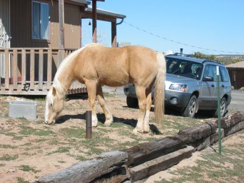

And here is the reason why you need a fence, if you want to be a successful gardener on the reservation: free range

The Natives (the word "Indians" is almost a derogative term here, but is used for tourist business) do not like to lock up their live stock and do not show much enthusiasm for other seperating devices either.

Tune in next week, when "Guido's Green Garden", the weekly reality show about gruesome garden catastrophes has its green and grimy beginning.
