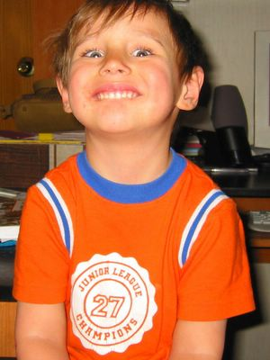

Kai has been enjoying his "school" (Headstart program) immensely. I am having difficulties to pick him up from school at times, because he protests that he is "not done yet!" This is in contrast to screaming fits in the past, when we (tried to) drop him off at the Babysitter's or Sunday School.
His teacher told me, that he is very talkative and that she has to stop him sometimes, so they can go on with the lesson. Since all other students in Kai's class are Navajo, he is learning some Navajo words and phrases along with his colors and shapes.
