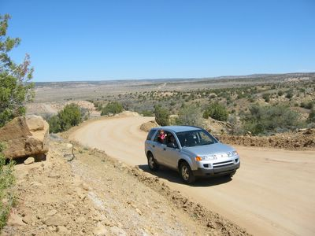

Heute, nach dem Gottesdienst, wollte Amy ein paar Lebensmittel kaufen. Da in der Metropole von Keams Canyon der Laden (ja es gibt nur einen...) am Sonntag geschlossen ist, mussten wir nach Dilkon (etwa ein Stunde südlich) fahren. Normalerweise bleiben wir auf den asphaltierten Highways, die auf der Reservation eher spärlich und deswegen in fast jedem Fall ein langer Umweg sind. Warum also nicht die Abkürzung durch die Prärie nehmen? Na klar!

Wir haben vor kurzem unsere zwei Kleinwagen gegen einen Grosswagen eingetauscht, da sich das mit unserem neuen kleineren Budget besser verträgt, wir auf dem Lande nur ein Auto brauchen und der Grosswagen einen höheren Straßenabstand hat. So groß ist dieser Großwagen nun auch wieder nicht, zumindest verglichen mit den Personenschutzpanzern die viele Amerikaner fahren. Wir wollten eben etwas haben, das besser geeignet ist auch mal eine Sandstraße zu befahren, die hier durch vom Regen aufgeweichten Boden oft tiefe Radfurchen entwickeln. Das SUV von Saturn, genannt VUE, schien uns ein guter Kompromiss zwischen Kleinwagen und Geländefahrzeug zu sein.

"Grosswagen" oder eventuell "SUV" ist übrigens ein besseres deutsches Wort für diese Autoklasse statt dem umgänglichen "Jeep". Ich weiss nicht wie dieses Wort in den deutschen Sprachegebrauch kam, aber es ist etwa genauso seltsam als wenn man alle viertürigen Autos "Mercedes" nennen würde:

"Klaus hat sich einen Mercedes gekauft?"
"Ja, es ist von Audi."
"Wie jetz..."

[Jeep](http://www.jeep.com/) macht genau drei Modelle, den [Wrangler](http://www.jeep.com/wrangler/) (das Modell das man generell mit dem Namen Jeep verbindet), den [Grand Cherokee](http://www.jeep.com/grand_cherokee/) und den [Liberty](http://www.jeep.com/liberty/), der den kleineren Cherokee abgelöst hat. Alle anderen Fahrzeuge sind keine Jeeps! Die haben ihre eigenen Namen, wie z.B der [Excursion](http://www.fordvehicles.com/suvs/excursion/) von [Ford](http://www.fordvehicles.com/), [Lincolns](http://www.lincoln.com/) [Navigator](http://www.lincoln.com/vehicles/navigator/default.asp?flash=1&feature=v210) oder, die Spitze der verschwenderischen Dekadenz, der [Escalade](http://www.cadillac.com/cadillacjsp/models/gallery.jsp?model=escalade) von [Cadillac](http://www.cadillac.com/). Okay, ich bin fertig mit dem Unterricht.

Also, was für eine Gelegenheit unseren neuen Saturn VUE mal einzufahren! Eigentlich, obwohl das Fahrzeug so aussieht, ist aber genau genommen nicht für den Offroad-Betrieb gebaut. Das sind übrigens die wenigsten SUVs. Sie täuschen dem Besitzer die Freiheit eines Geländewagens vor, wobei die Fahrzeughersteller genau wissen, daß die meisten Leute wohl schlimmstenfalls über die Geschwindigkeitshuckel zum Parkplatz bei der lokalen Einkaufshalle navigieren werden.

Jedenfalls bin ich dann einfach mal nach Süden auf eine vielversprechende Sandstraße abgebogen und los ging der Spaß!

(Im nächsten Eintrag gehts weiter)

After church today, Amy wanted to get some groceries. We had to drive to Dilkon (about an hour south of us), as the store (yes, there's only one) in the metropolis of Keams Canyon is closed on Sundays. Usually we stay on the paved highways, which are rare on the reservation and, in almost any case, means going out of the way. Why not take the shortcut through the desert this time? Of course!

We recently had traded our two small Saturns for a bigger one, as that agrees more with our new budget, and out in the country we only need one vehicle, and the bigger one had higher clearance, too. Well, it is actually not that big, at least compared to the armored troop carriers some people drive. We wanted to get something that can drive on the occasional dirt road, which, softened by the rain, can develop deep ruts here. The SUV from Saturn, the VUE, seemed a good compromise between a sedan and an off-roader.

\[In the German text I explain that "Jeep" is not a smart translation for SUV. Not sure how that became colloquial in Germany...\]

So, what a great opportunity to try out our new Saturn VUE! As a matter of fact, even though it looks that way, this car is not really designed for offroad use, which as I understand it, most SUVs are not. They fool the owner into believing they drive an offroad capable vehicle, but the manufacturers know exactly, that the worst most people have to deal with, is when they need to navigate those speedbumps at the local mall.

In any event, I turned south onto a promising dirt road and the fun began!

(Continued in next entry.)
