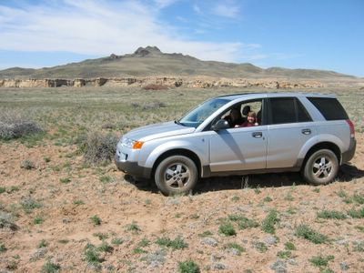

Die Sandstraße die vom Highway abging war zweispurig und gar nicht so schlecht. Fester Sand, keine tiefen Furchen, wir waren uns sicher, daß wir ein paar Minuten einsparen würden. Dann kam die erste Weggabelung und wir verstanden schlagartig, warum es eventuell nicht so schnell gehen würde wie wir uns das wünschten. Keine Schilder oder Straßenbezeichungen, einfach nur eine Gabelung. Links oder rechts? Wir entschieden uns für den rechten Pfad, da er ein wenig befahrener aussah als der linke. Nur ein paar Minuten später fanden wir heraus warum: der Weg endete in einer kleinen Siedlung. Er wird sicher regelmäßig vom Schulbus befahren und sah deswegen besser aus. Also, alles wieder zurück und die linke Abzweigung genommen.

So ging das ein ganze Weile weiter und obwohl wir eine Karte hatten war jede Abzweigung eine Fahrt in das Ungewisse. Irgendwann wurde aus "links" und "rechts" "mehr südlich" und "das ist zu östlich!" So kamen wir zu der Stelle die oben im Bild zu sehen ist. Obwohl es auf diesem Photo schwer zu sehen ist, sind wir immer noch auf einem fahrbaren Pfad. Dieser verlor sich aber innerhalb von ein paar Metern im Steppenkraut - oder vielmehr Steppenläufer, so habe ich "tumbleweed" in einem [Blueslexikon](http://home.t-online.de/home/alexx/lexikon.htm) übersetzt gesehen. Diese entstehen, wenn Steppenkraut vertrocknet und vom Wind entwurzelt und umhergeblasen wird. Diese Steppenkrautknäuel verlieren während ihrer rollenden Reise ihre Samen und pflanzen sich somit weitreichend fort. Hier sind sie auch als "Russische Disteln" bekannt.

Wir fuhren etwas weiter, aber der Weg endete einfach in der Steppe. Kurz zuvor hatten wir einen Abzweig gesehen, aber der sah ganz so aus, als ob er bisher nur zweimal von den lokalen Viehhirten befahren wurde. Nichtsdestotrotz, das war besser als einen neuen Pfad zu "erfahren".

Nach vielem Hin- und Herlenken kamen wir uns bald selbst wie Viehhirten vor. Der Weg verlor sich oft in ausgetrockenen Schlammlöchern oder im Gesträuch, nur um einige Meter rechts or links wieder aufzutauchen. Diese wilde Jagd hinter einer längst weitergezogenen Herde führte uns schließlich zu einem Gehege neben einer aus dem Steppenboden herausragender Felsenformation. Aha, ein Zeichen der Zivilisation mitten im Nichts! Einfach dem Zaun folgen, soweit das geht... Ein paar Findelsteine, Sandlöcher und noch mehr Gestrüpp weiter kamen wir wieder auf einen ziemlich guten Weg.

Eine Meile oder so später, das nächste Rätsel: Ein Stacheldrahtzaun überkreuzte den Weg, kein Ende in Sicht in beide Richtungen. Ein Glück lies sich der Zaun aber teilweise auseinandernehmen und bildete somit ein primitives Tor. Durchfahren, wieder aussteigen, den Zaun "reparieren" und weiter gehts... im nächsten Eintrag.

The dirt road that came off the highway had two lanes and was not all that bad. Packed sand, no deep ruts, we were sure we would save a few Minutes. Then came the first fork in the road and we suddenly understood why we might not get there as fast as we would have liked to. No signs or road names, just a fork in the road. Left or right? We decided on the right path, as it looked a bit more driven on than the left. Just a few minutes later we discovered why that was: the path ended in a small settlement. It probably is used regularly by the school bus and thus looked better. So, back to start and take the left this time.

That is how it went for a while and, even though we had a map, every turn led to more uncertainty. Sometime along the way, "right" and "left" became "more to the south" and "that's to far east!" Thus we arrived at the place depicted in the photo above. Even though it is hard to see on this picture, we were still on a small path, though it soon got lost in the tumbleweeds.

We drove a bit further, but the path just ended in the desert. We had seen another path shortly before, but it looked like it was driven on by the local herders about twice. Nonetheless, that was better than to blaze a new trail.

After much steering, we almost felt like local herders, too. The path got lost in dried mudholes or brush, only to reappear a few feet to the left or right. This wild chase after a long gone herd finally led us to a corral next to a rock formation jutting out of the desert floor. Aha, a sign of civilisation in the middle of nowhere! Just follow the fence, as far as that is possible... A few boulders, sand holes and even more brush later we got back onto a pretty good trail.

A mile or so further, the next riddle: A razor wire fence crossed the path, no end in sight in both directions. Luckily the fence could be partially disassembled and thus made a primitive gate. Drive through, get out again, "fix" the fence, and on it goes... in the next entry.
