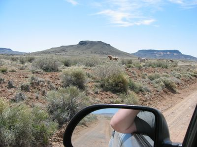

\- THE END -

The path after the gate in the razor wire fence got better and better, and eventually led to a two lane dirt road. On it we suddenly had oncoming traffic: a string of wild horses! Well, they could belong to somebody, you can't always tell here. Luckily, they went up on the side of the road and looked at us from a distance.

The road now ran straight west, but despite some smaller paths going south we stayed on the big one. The mountain range to the south did not look like it would get us to [Dilkon](http://www.mapquest.com/maps/map.adp?searchtype=address&country=US&addtohistory=&searchtab=home&address=&city=dilkon&state=az&zipcode=). After a while, the road bent left around the mountains and we saw a navigation help (for small airplanes) on a hill in the distance. Once we were close enough to read it, we found out that we were a few miles northwest of Dilkon and ended up on a paved street in [Tees Toh](http://www.mapquest.com/maps/map.adp?searchtype=address&country=US&addtohistory=&searchtab=home&address=&city=tees+toh&state=az&zipcode=).

Admittedly, this was not a shortcut, but you have to have an adventure drive now and then! The next time we'll bring the GPS and pay more attention. If not time, we could save a few miles, if we know where we're going... With these gas prices it should pay off.

That said, we took the highway back home, to spare our kids and the groceries a second desert odyssey.

\- THE END -
