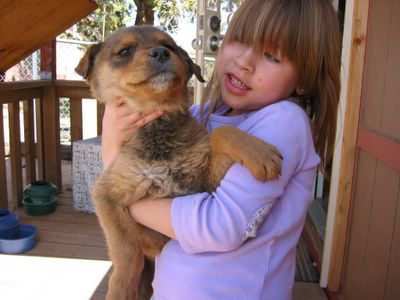

Well, how can you withstand these Puppy Looks? This one was running around at the school and somebody had obviously dropped it off at the chapter house across the street. I, being a cat person, protested somewhat, but was easily outvoted.

However, I'm usually giving the names to our pets, and I thought Muddy would be cute. The puppy was muddy when we found it. We have now idea what breed it is, but it seems to be a mutt (mutty -> mudblood (from Harry Potter) -> muddy). And its fur looks muddy too.

Amy likes Mischa (mee-sha) better, which was an early candidate I developed out of Mischling, the German word for mutt and Misha the Russian name.

So, the fight is on. What's it gonna be? Muddy or Mischa? Please leave a comment. Thanks!
