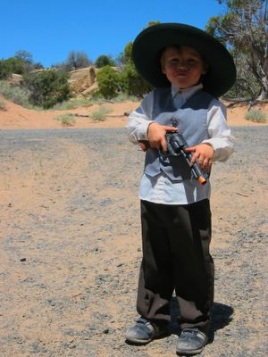

Auf diesem Bild sieht man einen lokal ansässigen Cowboy mit Revolver in unserer Einfahrt. Ich habe das Photo in Richtung Norden aufgenommen, damit man die Aussicht auf den Mesa, der gleich hinter unserem Haus liegt, sehen kann. In einer Vertiefung vor den Felsen hatte ich vor einiger Zeit die [wilden Hundebabys photographiert](/blog/2005-04-21-noch-mehr-hndchen-even-more-puppies/). Unsere Straßen sind größtenteils einfache Sandstrassen oder wie hier zu sehen teilweise mit Schlacke belegt. Zwischen den größeren Orten gibt es natürlich auch asphaltierte Straßen.

Die Bäume im Hintergrund sind entweder Zedern oder Wacholder, soweit ich weiß, die beiden einzigen hier natürlich wachsenden Baumarten.

On this picture you can see a local cowboy with revolver in our driveway. I took the photo towards north, so that you can see the view on the mesa that lies right behind our house. I took the [wild puppies picture](/blog/2005-04-21-noch-mehr-hndchen-even-more-puppies/) in a dale before the rocks there. Our roads are mostly dirt, but are sometimes fortified with gravel, as you can see here. There are paved roads between the bigger places of course.

The trees in the background are either cedars or junipers, which, as far as I know, are the only two natively growing tree species here.
