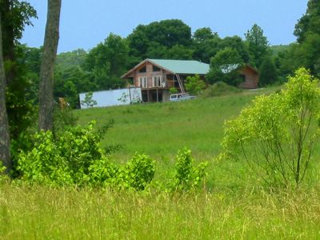

Volunteered to chauffeur Grandma Ruth home to Arizona from a visit to Dan in Illinois in June. The [route via St. Louis was suggested by Mapquest](http://www.mapquest.com/directions/main.adp?go=1&do=nw&amp;amp;amp;amp;rmm=1&un=m&cl=EN&ct=NA&rsres=1&1ahXX=&1y=US&1a=&1c=Jeddito&1s=AZ&amp;amp;amp;amp;1z=&2ahXX=&2y=US&2a=&2c=Herod&2s=IL&2z=) as the fastest, but the many construction zones and two t(r)oll roads did not convince me to use it again. Traffic was often dense and I missed my exit in St. Louis because of construction closures.

Arrived in Shawnee National Forrest late at night and could not find the way to Dan's ranch in all the fog. Back to civilization, looking for a working phone... but sometime before midnight I made it in one piece.

The picture above was taken during the official tour of the premises in the [six wheeled Gator(TM)](http://www.deere.com/en_US/ProductCatalog/HO/servlet/ProductPhotoGalleryServlet?pNbr=1934W&tM=HO&phtGlryLink=%2Fen_US%2FProductCatalog%2FHO%2Fphotogallery%2Ft_series%2Ft_series_photogallery.html). Dan planted a few fake crops to lure game closer to the stands and the heavy snow of last winter also caused much change in the local flora.

As you can see, the main lodge is making good progress. The kitchen, the master bed room and two bathrooms are working and in use. The living room, or rather the living hall, is still a bit rustic but usable. Now the big semi-trailer in front of the house just needs to be unloaded... I'll report more, when we will stay longer in July.

For the return trip, I picked [the route](http://www.mapquest.com/directions/main.adp?go=1&do=nw&amp;amp;amp;amp;rmm=1&mo=ma&2si=gaz&1gi=0&amp;amp;amp;amp;un=m&1da=-1.000000&1rc=A5XAX&1n=Pope&cl=EN&ct=NA&2n=Navajo&1si=gaz&amp;amp;amp;amp;2rc=A5XAX&did=1118775267&rsres=1&1ahXX=&1y=US&1a=&1c=Herod&1s=IL&amp;amp;amp;amp;1z=&2ahXX=&2y=US&2a=&2c=little+rock&2s=AR&2z=) via (or actually, by) Memphis, Tennessee. Much less stressful, no tolls and, in my subjective opinion, even faster. We drove all the way to [Elk City](http://www.mapquest.com/maps/map.adp?ovi=1&zoom=1&mapdata=dxMkxKq30wkMbLpZNF1%2fe16JyMgXxyv5RCVWGwshK9ZoyupuWzOLbk4f3kSjFxMLXNlSfrHtYCG1pBFWUvArTDr82FPruAbQ%2b3Kk2%2f2SNSDxjPqrLAfxdD9e4J7l2CPKcGbsff9313dW9098U5b9BtKdu%2f5fjFxmZik8w%2bLahrTX1bzPLcKhFM%2bNmF2tLQhudztk2H25A93YoBPeZqfcmoJLEfZoJOb4YeFIHm5JRpnAQJPYhbx6nnT7HGS%2fpoqKzIyg8fzRnnGAUJyhUlHkpOGt%2b1mwifSSxkCzYzbltNVB9Du81NrQ4wTVtDIN7JlJLvfC468p7Bo6RiU2%2b2sf6jyWjcMU3fInEzIoYd0Oq4x%2br3XPpxGzoRKIuNTrO59TVXnSeG4Vu3SRBNXgrvwJ41SPuIvPQ%2fR%2b8PHCmxtvClpHEFuIW1Ctyw%3d%3d), OK on the first day and then Jeddito on the second. Showed Grandma Ruth our new surroundings and the [Walpi Hopi village](http://www.grandcanyonandindiancountrytours.com/walpi.htm) in (or on; depending on your perspective) [First Mesa](http://www.mapquest.com/maps/map.adp?pan=e&ovi=1&mapdata=OE4WNszgW9xdrzT3atN7usYuBjFQnh9zEQsf78p5K5lPZbY%2bQEG4qhp%2b11VYOelW%2fh7yisZQw5587mPLMk0F%2b1Fg0xGdLUhBLxwR0AteLPXiv989ccqbq89dY102q8tWSNT%2fZGXJOgHjLAEDpmIjVzr4ogGZq%2f5r4Ip%2fb0ASG4qWRCiWazObQUBpdf6UuxyS8pSgfxjQuVcN9ZDJgfl7SsVtUeHwQzKmzBCJpfa4lFg8%2fQ8KahOEQq5L8jEH7o2sFkDAQxu9oLvZp%2b4gNSTeWgiQksWfW4cGoo2cIS2ET%2bKM6dclkMtGNsu%2fxBY91PmRVVJMXI%2b0cAV754H8fxRm%2fuGY9oA0uXuSIQ4s4eVppnBcV%2f0ZQOjG8AtFcdehHLUMGlyPjgU32kc1uyLe60SexGAoyHXrXqlr), then drove her home the next day.

I had a little adventure on my way back, as I decided to take the route via [Strawberry](http://www.mapquest.com/maps/map.adp?ovi=1&zoom=3&mapdata=OE4WNszgW9xdlPOTcxbeqzso5UURPp6JLwFTo9vpiO7eqGpjGRfaaONYdk3nMRx%2bam4IMqppy7MzrKH5B3ZDmrYoc3O%2b4JtBO0ofRm%2fyB%2fqUAqUeHGy8xZxjnl3JUVrtUTncKvGEUELXEiGVpM24GkJNt5BrlzgPUjdVvwT%2fhBEtGm%2bWj%2fU9TO5pSgdjxapF9fZjD0cEVWPA53%2b0xdkhpSGA54c4YQPpiiBoGRC9uV5yyZscE0LsV9ozqj6qM72OcS5WODLLEIawkMaqgwysQAbviE7YDMCdVPPzlRanu7oBa2w0SOMnr3aA51up%2b4nEG4hLqWGtympJRS6JaleEtkGWXXbEppHnlizKgT8FmiiZPGZLrWkAfWAs8Wtc68Ve%2bf3L6GCdGpbmwAriijXIP8bvq8VXnYB6nojBVu8eEKphQKsKWjqlfLCNdYjTltIM). Only a two lane highway, but much nicer than the other way. Saw lots of forest and game, including a very [fat deer](http://en.wikipedia.org/wiki/Image:Baribal.jpg) that walked in front of my car... Wait a minute, that is a bear! Wow, National Geographic, right through my windshield. Never thought I'll see one in real life. It seemed to be a young black bear, just like the one on the right in the picture. After he noticed me, he ambled off into the bushes in that typical bear gallop. Too bad I had unpacked my camera at home.
