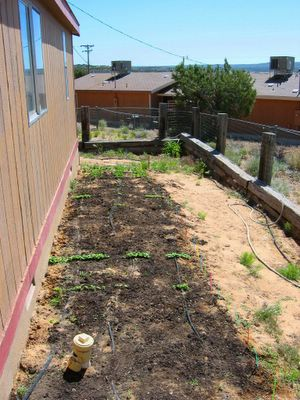

[Zu Folge 3](http://www.blogger.com/email-post.g?blogID=11866959&postID=111695183714889875)

The radishes, the spinach and the Peas grew pretty fast. The onions still look a bit thin, but at least were much easier to raise than in the plastic dome. Next time I'll sow everything right into the garden. The gaps in the rows are caused by the spaces between the soaker hoses. Maybe I should lay them closer together, if the seeds in between are not sprouting at all.

The herb corner and the flowers are not done yet, except for a few lilies (in the back right corner) and a hollyhock, which the neighbours gave me. The hollyhock looked pretty limp after the move, but she recovered well. Let's see if the lillies are not to stressed and bloom this year already.

[To Episode 3](http://www.blogger.com/email-post.g?blogID=11866959&postID=111695183714889875)
