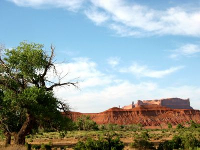

This year we signed up for the annual mission trip to Rock Point organized by our former church in Mesa, [Victory Lutheran](http://www.victorylutheran.com/). For one week, we will live together with old friends from our church on the premises of the [Navajo Evangelical Lutheran Mission](http://www.nelm.org/) in [Rock Point, Arizona](http://www.mapquest.com/maps/map.adp?searchtype=address&country=US&addtohistory=&searchtab=home&address=&city=rock+point&state=AZ&zipcode=) and help with needed repairs and vacation bible school for the local kids.

I snapped the photo on our way up. The landscape looks just like the Painted Desert, but has rock formations that are reminiscent of Monument Valley.

As we live much closer in Jeddito as other participants, we only left at 3:30 pm and still arrived first at 6:30 pm (7:30 local time). At 8:30 pm local time we went and got the keys to the appartments and around 10 pm the rest of the group arrived. We learned that one of the kids did not travel well and that they had to stop four times for throw-up breaks (and twice for something to eat).

The appartments are very comfortable and some even have Internet. I am planning to write a photo entry each day, unless I am too tired from working... ;-)
