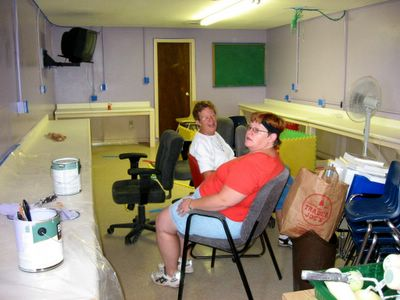

Today, we painted the computer lab of the school at the mission. It went pretty quick with six people and we had the room done by the afternoon.

But it was hot!

The little window air conditioner couldn't keep up with the cooling, but luckily it cools off pretty easily in the evening, as we are at about 5500 feet.

The rest of the day was spent doing other life sustaining things like sitting in front of the air conditioning unit... or [blogging](http://www.wilwheaton.net/)...
