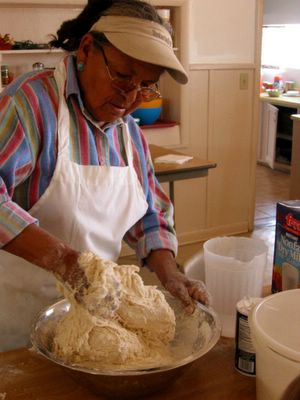
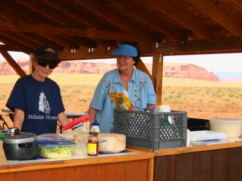

This brush is used to fill the many tiny holes in the concrete blocks:

Pioneered by Linda, the specialized brush is used in a circular movement technique and works much faster than a paint roller.

In the afternoon we went to Norma's new settlement on a hill surrounded by breathtaking rock formations. There, we white skins were taught how to make Navajo Fry Bread.

The dough was prepared beforehand by Norma at the mission kitchen. She took a few handfuls of flour and backing powder, a pinch of salt and some dry milk and kneaded the dough until it looked like wet pizza dough. When I wanted to pin her to a precise receipe, she only said: "Oh, just enough until it feels right..."

If I can repeat it successfully at home, I will post instructions.

Everybody had a ball (of dough that is) and tried to form it into a flat round bread. This part is affectionatly called the "Geography lesson", as it is fun to guess the various state shapes every participant ends up with in an effort to make a circle-shaped bread. After everyone resigned themselves to their varied stages of lopsidedness, the bread was handed to Norma or boldy laid into the pan and then expertly fried by her.

Then we piled on the hamburger, cheese and veggies to make it a Navajo Taco. State shapes aside, it tasted fantastic with the added aroma of the scenery and the "salt of the earth" community of friends in Christ.

