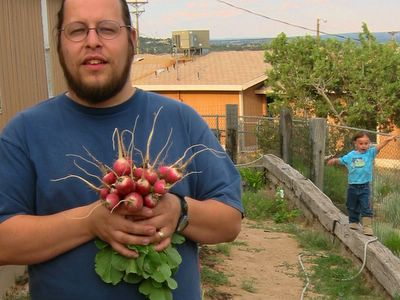

Die Radischen sind fertig!

The radishes are ready!

Muttern musste mich erst mal über diese langen hohen Radischenpflanzen aufklären, von denen man im obigen Bild zwei sehen kann. Dies sind Samenerzeuger und hätte ich sie nicht mit den anderen herausgerissen, hätte ich kostenlose Samen für nächstes Jahr gehabt! Auch hat sie mir vorgeschlagen den Tropfschlauch entlang der Reihen und nicht quer zu legen. So hätte ich diese Lücken vermeiden können. Also wie ihr seht, muß ich noch einige Tricks lernen.

Trotzdem hab ich mich mal von Amy als stolzer Heimgärtner ablichten lassen:

My mom had to enlighten me about these long, high radish plants, of which you can see two in the picture above. Those are making seeds and had I not ripped them out with the other ones, I could have had free seeds for next year! She also suggested to lay the soaker hose along the rows and not accross, to prevent those gaps. So, as you can see, I still got to learn a few tricks.

Nonetheless, I let Amy snap a picture of me as proud home gardener:

Im Hintergrund kann man die blühenden (trotz Umpflanzung!) Lilien und Stockrose sehen. Das Unkraut hatte natürlich eine wochenlange Party... Weiß nicht ob ich das vor unserer langen Reise am Sonntag noch unter Kontrolle bekomme.

In the back you can see the blooming (despite transplanting!) lillies and hollyhock. The weeds had a weeklong party, of course... Dunno if I can get it under control before we leave for our big trip on Sunday.
