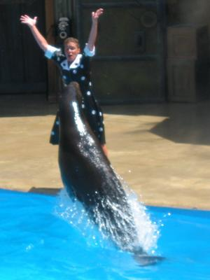
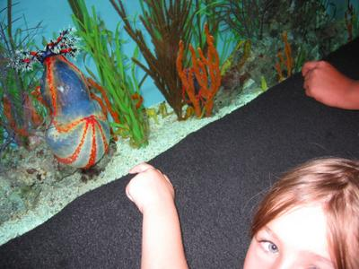
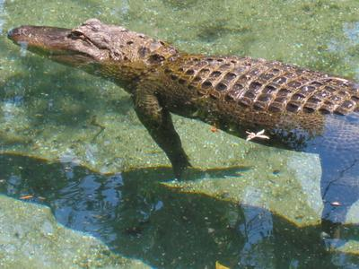
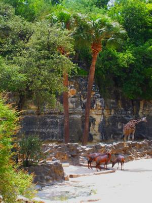

... that it took so long to hear from me again.

The hotel we stayed at in San Antonio acted really stupid. They only had wireless Internet, and I had to borrow on of their Adapters and since I did not equip Brenda's computer with a Wireless card. I was only allowed to keep it for a maximum of two hours or I would have to pay a "late fee". Of course I only submitted to this nonsense for one time.
To hang another pine cone on the tannenbaum, they decided on our day of departure that we lost or even packed their stupid adapter (which would only work in their silly hotel anyway!) and now wanted a reimbursement fee of $400. We were miffed... Luckily, I got my lovely wife, Amy; she bitched at them for a while and they let us go after only half an hour...
Whoever wants to avoid this, for American standards, unfriendly and unprofessional hotel when they vacation in San Antonio, Texas next time:

> [Woodfield Suites](http://www.woodfieldsuites.com/lq/properties/propertyProfile.do?ident=LQ7003&returns=&promocorp=)
> [100 West Durango Boulevard](http://www.google.com/maps?q=Woodfield+Suites&spn=0.013423,0.020262&near=San+Antonio&cid=29423889,-98493333,9546772441206284860&num=10&start=0&hl=en)
> [San Antonio](http://www.sanantoniocvb.com/), [Texas](http://www.traveltex.com/) [78204](http://www.zip-codes.com/zips/78204/default.asp)
> [USA](http://www.cia.gov/cia/publications/factbook/geos/us.html)

> [Woodfield Suites](http://www.woodfieldsuites.com/lq/properties/propertyProfile.do?ident=LQ7003&returns=&promocorp=)
> [100 West Durango Boulevard](http://www.google.com/maps?q=Woodfield+Suites&spn=0.013423,0.020262&near=San+Antonio&cid=29423889,-98493333,9546772441206284860&num=10&start=0&hl=en)
> [San Antonio](http://www.sanantoniocvb.com/), [Texas](http://www.traveltex.com/) [78204](http://www.zip-codes.com/zips/78204/default.asp)
> [USA](http://www.cia.gov/cia/publications/factbook/geos/us.html)

Other than that, our stay in San Antonio was great (and hot)! See photos:

Here we are at the [River Walk](http://thesanantonioriverwalk.com/). In the background you can see the convention center, where Amy had her [Women of ELCA](http://www.womenoftheelca.org/) conference.

As tourists, the boat tour was of course obligatory. [Here](http://hotx.com/rb/rbtour-j/as00.html) is a virtual tour, if you are in sightseeing mood.

While Amy was conferring with the women of ELCA, the kids and I visited the local attractions, like [Sea World](http://www.seaworld.com/seaworld/tx/default.aspx)...

... and the San Antonio Zoo with kangeroos, ...

...with its Sea cucumbers...

... und Delphinen, ...

... and Dolphins, ...

In other words, we had a fun time.

... und Alligatoren, ...

... and alligators, ...

... Rhinos ...

... und Giraffen.

... and giraffes.
