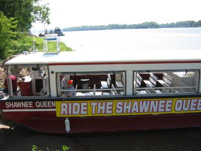
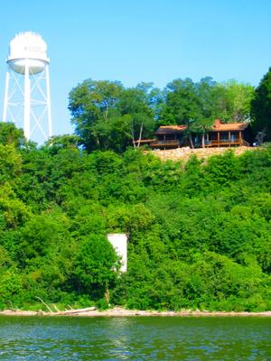
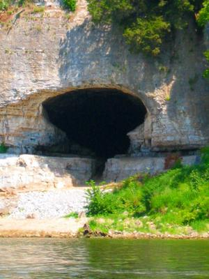

When we stayed with Dan and Janet, we traveled the Ohio river aboard the Shawnee Queen. We got up extra early to beat the crowds, and, as you can see on the picture, we did. We were the only ones on the whole boat tour.

A nice little house by the river cliff... I'd like to move in there.

For a long time, Cave-In-Rock was a base for river pirates. Until the early 19th century, they attacked and plundered boats and murdered passengers.

The Ohio River, at 981 miles in length, is the principal tributary of the Mississippi River, which in turn is the second largest river in the United States at 3,895 miles. The Ohio was the border between slave territory and the free states until the Civil War.

The cave, about 100 feet deep, has a vertical chimney in the back and was a perfect stronghold for the outlaws with its wide view of the river. The notorious robber Samuel Mason even led a faux casino in the cave, complete with bar, gambling cards and prostitutes. Many of the guests ended up beaten and robbed, or even dead, on the rocky bank of this cliff cave. The pirate and ghost legends are part of the local folklore even today.
