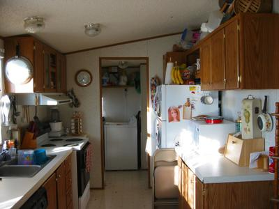

Nun da die Gartenserie ein abruptes Ende gefunden hat, und weil Du, liebe Mutti, in den Kommentaren ein paar mal nachgefragt hast, ist es an der Zeit diese alte Serie endlich fortzusetzen. Die letzten beiden Folgen sind [hier](/blog/2005-05-24-das-neue-zuhause-new-home/) und [hier](/blog/2005-05-24-das-neue-zuhause-2-new-home-2/).

Das ist meine kleine Küche, in der ich so gerne koche. Links sind die Fenster zum Garten hin. Gerade zu geht es in den Waschraum, der links um die Ecke die Hintertür beherbegt. Ganz oben rechts könnt ihr meinen Wok sehen, mit dem ich das allseits beliebte Chinese herbeizaubere. Der Weinflaschenbehälter auf dem Brotkasten wurde zum Spaghettigefäß umfunktioniert und die komische Stoffwurst hinten beim Kühlschrank ist ein Plastiktütenhalter. (Einfach oben reinstopfen und unten bei Bedarf rauszupfen, violett! schon hat man eine gefüllte Plastiktütenzupfstoffwurst!)
Brotkästen sind in den USA übrigens eine Seltenheit, da hier das Brot fast immer vorgeschnitten und kastenförmig ist. Es wird stattdessen im Gefrierfach oder der Mikrowelle aufbewahrt, oder liegt einfach irgendwo rum. (Designierter Brotplatz? Dafür sind wir zu modern!)
Diese Gefrierfachidee ist übrigens gar nicht so dumm. Macht sich bestimmt auch für deutsches Toastbrot gut: Morgens einfach ein paar Scheiben vom gefrorenen Laib abtrennen (geht ganz einfach per Hand) und in den Toaster werfen um ladenfrischen Toast zu erhalten. Violett!!
Andere seltene Artikel in amerikanischen Küchen sind der Fleischklopfer (wenn überhaupt, werden chemikalische Fleischweichmacher benutzt), der Schneebesen und der Quirl (viele Amerikaner benutzen eine normale Gabel(!) zum Teig anrühren).

Now that the garden series found its sudden end, and because my dear mom has asked a few times in the comments, the time has come to finally continue this old series. The last two episodes can be found [here](/blog/2005-05-24-das-neue-zuhause-new-home/) and [here](/blog/2005-05-24-das-neue-zuhause-2-new-home-2/).

This is my little kitchen I like to cook in a lot. To the left are the windows overlooking the garden. Straight ahead is the laundry room, which, to the left around the corner, contains the backdoor. You can see my wok at the very top on the right, with which I conjure up the ubiquitously beloved Chinese food. The wine bottle container on the bread box was recast as the spaghetti container and the weird fabric sausage at the back by the fridge is a plastic bag holder. (Simply stuff it into the top and, when needed, pull it out from the bottom, viola! now you got a stuffed plastic bag pull sausage!)
Bread boxes, by the way, are a typical German accoutrement. Most bread is not pre-sliced and kept in these containers of diverse design. When a sandwich need arises, the slices are cut freshly from the loaf using the equally ubiquitous, and in the US equally elusive, bread slicing machine. Viola!!
Other fundamental essential cooking utensils are the (preferable wooden) [meat tenderizer](http://www.schneidup.de/images/medium/2004_0316bild0087.jpg), the whisk (Germans call it Schneebesen, snow broom, as whipped egg whites are usually refered to as egg snow) and the [Quirl](http://white-bears-trading.de/Weisser_Baer/Shop/Heim_Haus/Kuche/Holz/quirl_klein.html). I do not even know a good translation for the latter. It is a small compact whisk used for stirring batter and dough. At first I did not believe Amy, that Americans use a simple fork. How barbaric!

Die andere Seite der Küche geht in die Essecke und links in die Wohnstube über. Geradezu ist die Tür zum Schlafzimmer und rechts hinter der Wand, das Elternbadezimmer.
Kai schlürft gerade seinen Morgenkakao. Auf dem Schrank stehen meine Öle und Gewürze. Diese blaue Gefäße hat mir Janet beim ihrem Umzug überlaßen. Nochmal danke, Janet!

The other side of the kitchen connects to the dining area and, to the left, to the living room. Straight ahead is the door to the master bedroom, and on the right behind the wall is the master bathroom.
Kai is just slurping his morning coco. On the cupboard are my oils and spices. Janet left me these blue bottles while they where moving. Thanks again, Janet!
