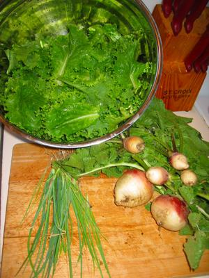

Trotz der ungeplanten Sommerdürre, haben ein paar Gemüse sich wacker geschlagen und lebten auf, als ich das Wasser wieder andrehte. Ich konnte am Ende doch noch ein paar Salate, Rüben und Zwiebeln oder Schnittlauch (weiß nicht so genau) ernten. Der Salat war hoffnungslos bitter, aber die Rüben und der Lauch machten gutes Suppengemüse.

In spite of the unplanned summer drought, some veggies struggled hard and perked up, once I reestablished the water flow. In the end, I was able to harvest some lettuce, turnips and onions or chives (not sure which). The lettuce was hopelessly bitter, but the turnips and chives made good soup vegetables.
