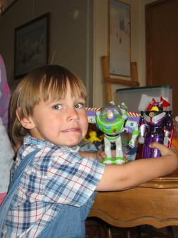
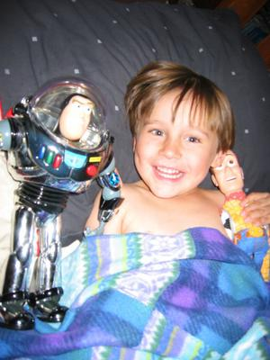

Here are a few pictures of Kai's little birthday party. The boy on the left is Kai's best friend, James, and is our neighbour. Kai asked for a chocolate cake. Luckily, the mix included baking instructions for high altitudes.

Kai really liked the transformer versions of Buzz (transforms into a space ship) and Zurg (transaforms into a battle tank), even though he is pulling a face here. He watches Toy Story 2 almost religiously, now he can re-enact it, too.

He was even more happy about the full size Woody and Buzz. Complete with hat, guitar and speech feature. (Sadly, Woody does not say the famous "there's a snake in ma boot.") Buzz has his laser, communicator and a energy disk shooting back pack thingie. You probably can easily guess who fought hard for these not too cheap toys on eBay... ;)

Afterwards we went to "Family Reading Night" at school, where Kirin and Kai did arts and crafts, read and won prizes. Back home, Kai wanted his new friends to sleep in his bed of course, even if they are not the snuggliest toys. They did not keep him from sleep at all. Sweet dreams, my big boy.
