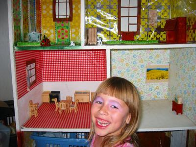

Hier ist nun endlich das (mütterlicheseits) ersehnte Photo des Puppenhauses, das Kirin zu ihrem sechsten Geburtstag bekam. Da es ein ehemaliges Möbelstück ist, ist es architektonisch gesehen eher ein Neubaupuppenhaus. Die Puppenmöbel wurden aus Holzschablonen per Hand von uns zusammengesetzt und anschließend spray-lackiert.

Ganz unten ist der Pferdestall, in der Mitte links die Küche und daneben das Wohnzimmer. (Mutti, erkennst Du den Blick aus dem Fenster wieder?) Oben links ist das Kinderzimmer und oben rechts das Elternschlafzimmer. Den Dachboden habe ich nicht rechtzeitig fertig bekommen, aber dieser kann ja, wie auch die Klingel, die Lichter usw., später immer noch angebaut werden.

Kirin hat sich jedenfalls riesig gefreut. Hier könnt ihr sie samt vom ersparten Taschengeld erworbener Schminke sehen. Den Lidschatten mag sie besonders.

englisch
