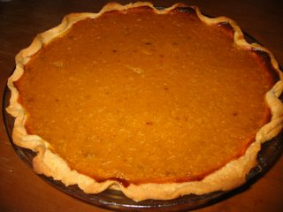
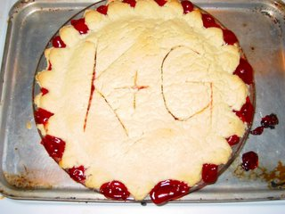

Here is the pumpkin pie I made from the insides of our Halloween pumpkin. It turned out tastier than I hoped for!

This was not my first pie, though. Amy had told me a while ago, that I would not be a real house spouse, unless I can bake a pie. I came back with a double crust cherry pie. Kirin helped me with preparing and baking it, so she got credit on top of the pie, too.

