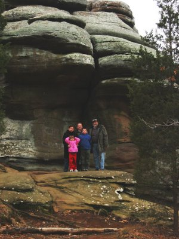
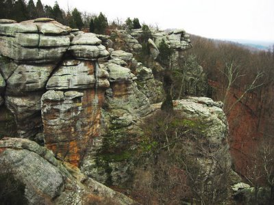
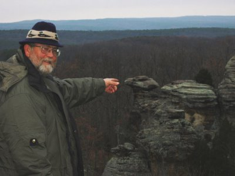
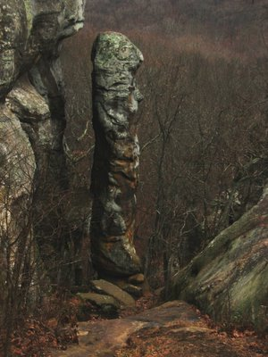
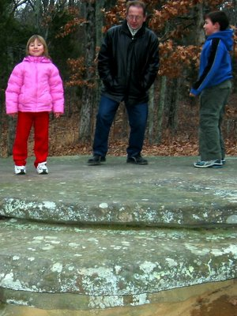

Finally some pictures from our visit at the Garden of the Gods. And I mean the park in Illinois, not the [cheap imitation in Colorado](http://en.wikipedia.org/wiki/Garden_of_the_Gods).

Here is a view on the common sandstone formations you can see almost everywhere on the tour.

Dan is pointing to Eagle Rock, which looks astoundingly similar to an eagle's head. The illusion works best when visiting in person, but can be simulated by blinking at your monitor.

To the left you can see the Devils Column, to the right the Rain Dance of the indigenous Biligaana. We really were lucky to see the tribal elder perform this unique ceremony, and, as you can tell by the low lighting of the pictures, the rhythmic hopping efforts were rewarded with success.

