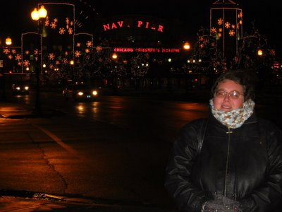
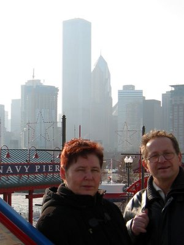
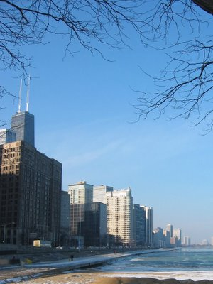
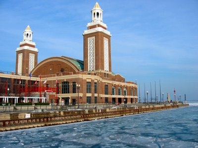
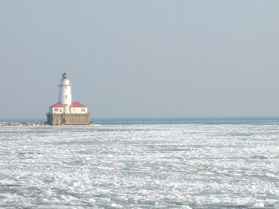
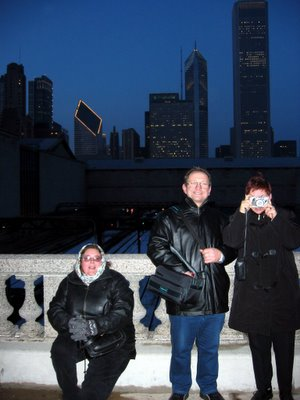
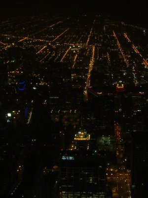

Wir kamen am Abend, bevor wir meine Eltern vom Flughafen abholten, in Chicago an und entschieden uns den Navy Pier bei Nacht anzusehen. Das war ein Fehler! Sie wird nicht umsonst "Windy City" (Stürmische Stadt) genannt. Eigentlich wäre "Arktische Stadt" ein besserer Beiname. Obwohl der Pier nur ein paar Straßen vom Hotel entfernt war, waren wir zwei Eiszapfen als wir ihn erreichten. Schaut euch mal das eingefrorene Lächeln von Amy an!

We arrived in Chicago the night before we picked up my parents at the airport and decided to check out the Navy Pier by night. This was a mistake! They don't call it Windy City for nothin'. Actually 'Arctic City' would have been a better epithet. Even though the pier was only a few blocks from our hotel, we where two icicles when we got there. Check out the frozen smile on Amy!

<table></table>

Am nächsten Tag hat die Sonne zwar etwas geholfen, aber selbst die sich am Eis wärmenden Deutschen mussten die Augen und anderen Organe zusammenkneifen.

The sun helped a little on the next day, but even the Germans, who usually warm themselves on ice blocks, felt the pinch and pinched their eyes.

Der Navy Pier bekam seinen Namen im 2. Weltkrieg, als er durch das Aufkommen des Automobiles als Zivilanlage ausgedient hatte und in den Dreißigern von der Navy zur Ausbildung genutzt wurde. Heute ist er ein Ort von Ausstellungen und Touristenattraktionen. Der Pier soll demnächst umfangreich renoviert und erweitert werden.

The Navy Pier got its name during World War 2, when it fell into disuse as a municipal facility with the rise of the automobile and was used for training by the Navy in the thirties. Today it is the place of exhibitions and tourist attractions. The pier will soon be expanded and renovated extensivly.

Das letzte Drittel unseres "Todesmarsches" (wie Amy es beschrieb), enthielt einen Ausblick vom Sears Tower, dem höchstem Gebäude der Welt (was [je nach Messung](http://en.wikipedia.org/wiki/World%27s_tallest_structures) umstritten ist). Alles in allem war auch unsere dritte Reise nach Chicago so beeindruckend wie die erste.

The last third of our "death march" (as Amy put it), included a view from the Sears Tower, the largest building in the world (which, depending on the [measuring methods](http://en.wikipedia.org/wiki/World%27s_tallest_structures) used, is contested). All in all our third trip to Chicago was as magnificent as the first.

