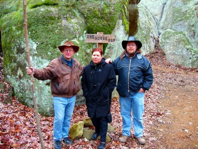
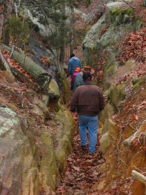
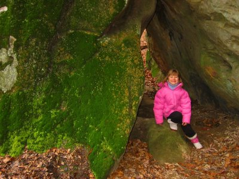

One Horse Gap is a gulch in the Shawnee National Forrest, which is just wide enough for one horse, hence the name. Here are three German trappers at the entrance of this nature hike.

Here is the actual gulch, a part of the [Illinois River-to-River Trail](http://www.rivertorivertrail.com/home.html) and the only connection from the bottom to the top of this cliff formation. This once important settler path is today one of the most beautiful hiking and [riding trails](http://www.onehorsegap.com/) in the Shawnee National Forrest.

<table></table>

Kirin had fun climbing through the moss covered rock formations.

