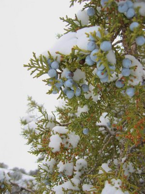
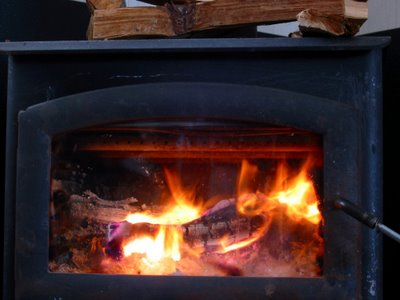
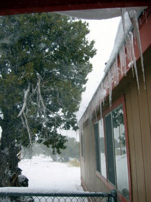
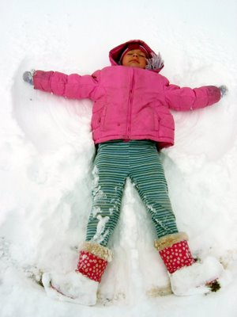
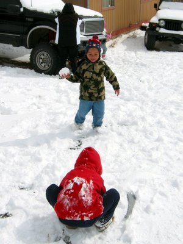
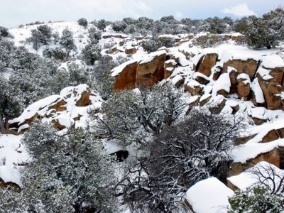

Vor ein paar Wochen bekamen wir endlich auch ein bißchen Schnee hier im niederschlagsarmen Arizona (143 Tage kein Regen). Es schneite zwei Tage lang und ich war froh, daß ich vorsorglich etwas Holz gespalten hatte. Das Feuer prasselte rund um die Uhr im Ofen. Die wenigen nassen Holzscheite trockneten wir auf dem Ofen und der Duft des Wacholders durchzog alle Zimmer.

A few weeks ago we finally got some snow in arid Arizona (no rain for 143 days). It snowed for two days and I was glad I had split some wood beforehand. The fire crackled in the stove round the clock. We dried the few wet logs on the stove and the smell of juniper pervaded all rooms.

Dieser Reichtum an winterlicher Freude mußte natürlich sofort ausgenutzt werden, da es in ein paar Tagen wieder verschwinden würde. Der Schnee war zu pulverig um einen Schneemann zu bauen, aber für Schnee-Engel und Schneeballschlachten war es genau richtig.

This wealth of wintery joy had to be exploited immediately, as it would vanish in a few days time. The snow was too powdery for a snowman, but just right for snow angels and snowball fights.

In zwei Tagen war alles vorüber. Es schmolz übernacht. Was blieb waren ein paar schmutzige Schneeflecken im Schatten der Felsen und die Erinnerung an einen Wintertag mit den Kindern.

After two days, everything was over. It melted overnight. All that remained was a few dirty snow patches in the shadow of the rocks and the memory of a winter day with the kids.

