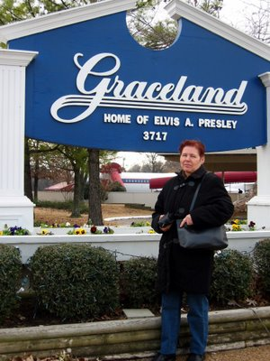
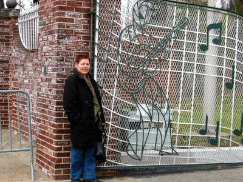
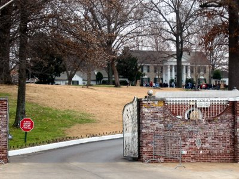

I had one of the coolest brain farts just before my parents arrived for their Christmas visit in Illinois. Mommy dearest is, despite the [Wall and media censorship](http://freepages.genealogy.rootsweb.com/%7Eeddunn/book/chapt7.html), an Elvis fan of many years, and never had [the faintest chance](http://www.epgold.com/highlights/army.htm) to even remotely squeal towards a pink cadillac. And what is just a [pithy 4 hours](http://maps.google.com/maps?f=q&hl=en&q=golconda,+il+to+graceland) south of the in-laws's house? [Memphis](http://www.cityofmemphis.org/framework.aspx?page=555), home of the [Blues](http://www.memphistravel.com/), birthplace of [Rock'n'Roll](http://www.bealestreet.com/home.html)! And what else is in Memphis, other than legendary Sun Studios that is? Yup, [Graceland](http://www.elvis.com/graceland/vtour/gracecam.asp), home of the King. There he lived and there he lies in peace. 3717 Elvis Presley Boulevard.

I didn't take my camera, because I had misunderstood the warning sign that said that no flash(!) photography was allowed, but the pictures probably wouldn't have turned out so great anyway, because of the dimmed lighting. However, there is a [virtual tour](http://www.elvis.com/graceland/vtour/default.asp) on the official website.

Here is mom in front of the famous "music note gate" and can barely keep herself from just running inside already. But no can do, we got to go back across the street, stand in line and wait for the next tourist shuttle...

The brick wall was covered in thousands of inscriptions by fans from all over the world and from all decades since the 50s.

After the tour of the mansion, there are the Meditation Garden, where Elvis, his brother and his parents are buried, the two custom jets, the car museum with the cars he owned and used in movies, and loads of souvenir shops. You can also stay the night and live like the King at the [Heartbreak Hotel](http://www.elvis.com/epheartbreakhotel/rooms/).

I expected a big deal of kitsch and glare, but was pleasantly suprised. While you can only smile over the all pink all plush king-sized bed with huge round canopy, the rest of the rooms of the first floor and the basement were furnished with much taste. The second level is off limits to the public, as the privacy of this area is guarded just as much today as it was when Elvis lived there.

When we were finally done, it was getting dark already and we drove a lap of honor to gape at the Christmas lights. All in all, it was a great trip, which I sincerely can recommend to all music and Elvis fans.

