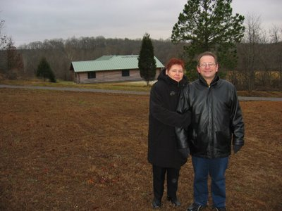
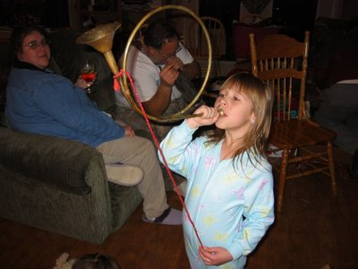
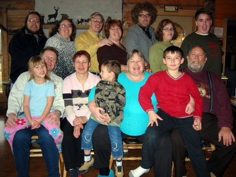
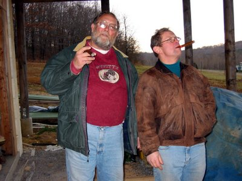
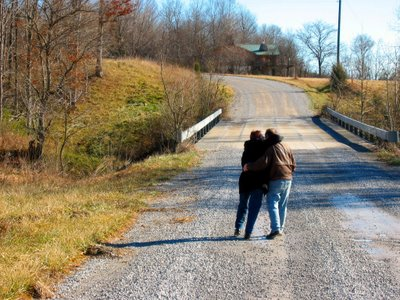

Here are the rest of the photos that I made during the parent's visit in Illinois. Depicted above are the two Germans on the Coen grounds with the hunting lodge in the background.

There we sang, drank, bugled, bag piped, elk roared and quacked into the New Year, employing all reachable instruments and animal sounds simulators,...

... zogen alle Anwesenden vor die Kamera, ...

... dragged everybody in attendance in front of the camera, ...

... watched the masters of the houses puff cigars, ...

... enjoyed walks in the Shawnee National Forest, and generally had a great time. Everybody agrees, that it was a sucessful meeting of the Coens and the Schlabitzens, and that we should repeat it in the near future. Of course, the American branch of the Schlabitz family can't wait at all and is moving all the way to Illinois at the beginning of June. Amy noticed how much she missed her parents and wants to live closer by mom, despite the beauty of the reservation. Now Edeltraut and Dieter only need to nudge themselves a bit and move here, too. It would save a bunch of plane tickets! ;-)

