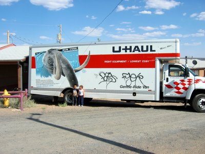

Unfortunately we could not pick up the moving truck in Holbrook as promised, but U-Haul had one in Show Low. About 45 min further south, but we got a 20% discount, wich is a lot with these across-the-nation moves. Then a mild shock at the gas station: I just wanted to top off the half-empty tank and had to pay $75 for 24 gal. That was half a tank...

Got the truck parked like I wanted it, so that the loading will be easier. The kids were running up and down the ramp and only stopped for a few seconds so I could snap these pictures.

Since our truck is apparently from New York, we even got real graffiti on it. 8-)

Update, Tuesday, June 6th: We're still here. The packing and loading is taking forever, as usual. We (or shall we say Amy and Janet) were planning to leave Tuesday Morning, but as it looks we're lucky if we leave Wednesday at noon...

