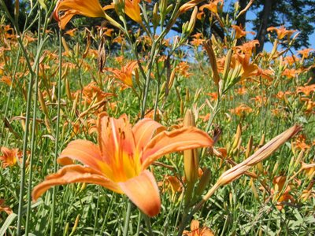

We arrived in one piece in Illinois and are enjoying the overabundant greenery, the many song birds and deer, and the amenities of the Coen residence. Above is a picture of the wild growing Asiatic Lilies. I have no idea what the species is, but the locals are simply calling them Tiger Lilies.

This one here is a whole different plant of the species Schlabitz which finally got trimmed. Of course a tick was found after the hairdresser removed the thicket and was expertly extricated by Grandma Coen. On this picture, we are just returning from a swimming trip to Pound Hollow Lake.

