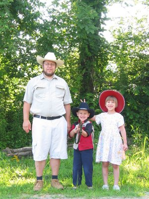

Kirins Vorderzähne hatten schon seit Weihnachten gewackelt, nun hatten Papa und Oma Janet genug und zogen sie (und ein gutes Stück Gaumen) unter viel Schreien und Treten des Patienten raus. Innerhalb von ein paar Minuten hatte Kirin sich beruhigt und war ganz froh, daß sie jetzt endlich raus sind. Wie im Bild rechts zu sehen wuchsen die neuen Zähne schon hinter den Milchzähnen ein.

Kirin's front teeth were wiggling since Christmas, but now daddy and grandma Janet had enough and pulled them (and a good piece of gums) out, ignoring much screaming and kicking of the patient. Kirin calmed down within a few minutes and was quite happy that they are finally out. As can be seen in the picture on the right, the new teeth were already growing in behind the baby teeth.

Neben den neuen Zähnen haben wir uns auch neue Hüte im Agrarzubehörladen gekauft. Für mich sind typische Cowboysachen nicht nur Show, sondern erfüllen ihren Zweck, was ich heute beim Einsammeln der Heuballen schnell gelernt habe. Der neue Hut hat meinen Hals und das Gesicht vom Sonnenbrand bewahrt und meine langen Jeans (auch bei heißem Wetter) hielfen beim Klettern auf dem 5 m hoch gestapeltem Heuhaufen, aber ich brauche noch ein langärmliges Hemd um Kratzer an den Unterarmen zu vermeiden und Lederstiefel, die Käfer und Zecken daran hindern in die Hosen zu kriechen. Der Gürtel hält die Hosen da wo sie sein sollen und ein Halsband fängt den Schweiß auf. Im Handumdrehen trägt man eine komplette Cowboyuniform...

Beside the new teeth we also bought some new hats at the tractor supply store. A typical cowboy outfit is not just for show in my opinion, but fulfills a purpose, which I got to experience first hand today when we were collecting hay bales. The new hat protected my neck and face from sunburn and my long jeans (even in hot weather) helped when I crawled all over the hay stack stacked 10 feet high, but I also need a long sleeve shirt to prevent the scratches on my forearms and leather boots to keep bugs and ticks from crawling up under my pants. The belt holds the pants where they belong and the kerchief soaks up the sweat. Before you know it you're wearing a complete cowboy outfit...
