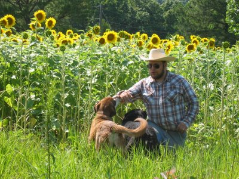
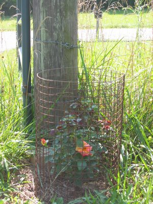
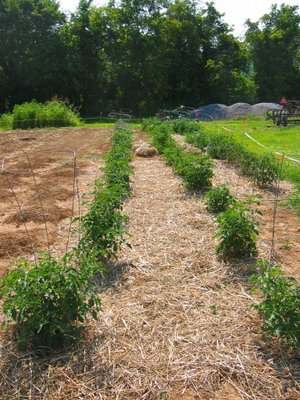
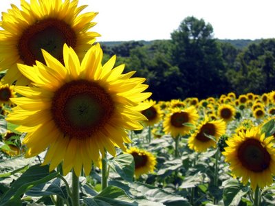
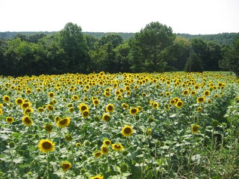
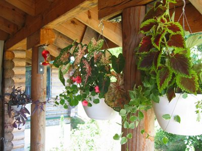
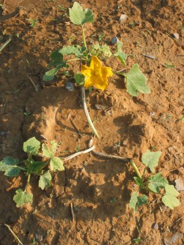
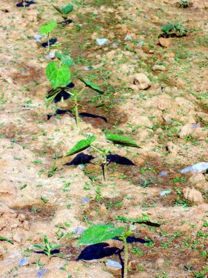

Text noch nicht fertig!

Kaum in Illinois angekommen fing ich natürlich gleich zu Gärtnern an. Neben dem vorteilhaften Klima, gibt es hier auch viele Gartenschädlinge: Tomatenschwärmer (besonders die Raupen), Waschbären, Rehwild, Hasen und natürlich die in jedem Garten gefürchteten Canis lupus familiaris, wird manchmal auch "Hund" genannt. In diesem Bild versuche ich zwei Exemplare davon zu überzeugen nicht über meine frisch gesähten Beete zu latschen. Die beiden sind Brüder und heißen "Tar" (Teer) und "Clay" (Lehm). Im Hintergrund kann man Dan's Sonnenblumenfeld sehen.

Am Tor habe ich Janet's Rose eingepflanzt. Die soll dann am Pfosten und Zaun entlangklettern, falls die Rehe sie nicht zu sehr dezimieren.

Hier sind Dan's 46 Tomaten. Hinten kann man den elektrischen Zaun sehen, den wir installiert haben. Bis jetzt hilft es mit diesen beiden, aber Buster weiß schon bescheid und steigt ganz vorsichtig übers Kabel. Wir haben nur ein niedriges für die Hasen und Waschbären gespannt.

ddd

ddd

