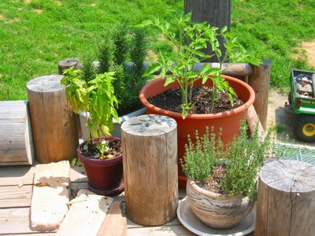

Hier ist meine kleine Kräuterecke. Der Topf für das Basilikum ist zu klein und trocknet zu schnell aus (gelbe Blätter). Ich hab' mal einen Stengel entfernt, vielleicht hilft das ja schon.

Im großen Topf sind Kirschtomaten. Der New Mexico-Topf hat was man hier "Deutsches" Thymian nennt. Weiß leider den lateinischen Namen nicht.
