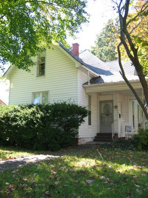

Hallo!? Liest hier noch jemand? 8-D

Hello!? Is anybody still reading this? 8-D

'Tschuldigung für die lange Pause, aber ich habe jetzt wieder weniger Freizeit. Wie einige von euch ja schon wissen, sind wir am 1. September nach langem hin und her endlich in unser neues Haus (Photo links, jaja, ich muss Laub harken...) in [Harrisburg, IL](http://maps.google.com/maps?hl=de&q=harrisburg,+il) eingezogen. Nicht nur das, ich habe auch endlich einen Job bei [Evolution Multimedia](http://www.evolutionmc.com/) gefunden und bin jetzt wieder von 8-5 Uhr auf Arbeit. Zur Zeit arbeite ich an der Partnerabteilung von [Stinky Fish Poker](http://www.stinkyfishpoker.net/), einer Online-Pokerseite. Das Spiel muss natürlich auch getestet werden, was hieß, das ich mal schnell Texas Holdem Poker für die Arbeit lernen musste. Die Webseite und das Spiel sind zur Zeit noch in Arbeit, aber bald könnt ihr euch mit mir übers Netz an einen virtuellen Pokertisch setzen.

Sorry for the long pause, but again I have less leisure time available. As some of you already know, we finally moved into our new house (left, I know, I know, I'm supposed to rake leaves) in [Harrisburg, IL](http://maps.google.com/maps?hl=en&q=harrisburg,+il) on September 1st. Not only that, but I also found a job at [Evolution Multimedia](http://www.evolutionmc.com/) and work from 8-5 again. Currently, I am working on the affiliate section of [Stinky Fish Poker](http://www.stinkyfishpoker.net/), an online poker site. Of course, the game has to be tested, which meant that I had to learn Texas Holdem for work in a hurry. The web site and the game are still being worked on, but soon you will be able to sit down on a virtual poker table with me.

Gleich nach der Arbeit geht es weiter mit Reparaturen am Haus. Es ist ein altes, um 1920 gebautes, zweistöckiges Haus mit hohen Zimmerdecken, knarrenden Stufen, seltsamen Lichtschaltern und ungefähr 232 Quadratmeter Charakter. Ich habe inzwischen praktischerweise gelernt wie man eine Stromleitung verlegt, Wasserhähne und Abflussrohre auswechselt, einen Eiswürfelmacher anschliesst, einen Gasherd installiert und zur Zeit versuche ich das Herbstlaub aus der Regenrinne zu halten. Die Rinne enthielt etwa 2-3 cm bester Komposterde, die das Ablaufen des Wassers erfolgreich verhinderte und uns einen luxoriösen Innenwasserfall im Keller bescherte.

Rigth after work I'm busy repairing the house. It is an old, two-story home, built around 1920, with high ceilings, creaking stair cases, weird light switches and about 2492 square feet of character. So far my hands-on education included laying power lines, replacing faucets and drain pipes, connecting an ice maker, installing a gas stove and now I am trying to keep the fall leaves out of the gutter. It contained a good inch of great compost soil, which was successfully stopping the water from draining and provided a luxurious indoor waterfall in the basement.

Amy hilft fleissig beim Umzugskisten auspacken. Sie hatte zuerst in einer christlichen Privatschule gearbeitet, sich aber dann entschieden wieder zu Hause zu bleiben, da die Tagesstättenkosten für Kai fast genauso hoch waren wie ihr Einkommen. Weiterhin hat sie ihren Zertifikatstest für Illinois Lehrer mit Bravour bestanden, und hat vor sich in ein zwei Jahren, wenn Kai zur Schule geht, wieder als Grundstufenlehrerin zu bewerben.

Amy is helping with unpacking the moving boxes. At first, she worked at a local Christian school, but then decided to stay home, as the day care costs for Kai were about as much as her income. She also passed her Illinois teacher certification test with flying colors and plans to apply for a teaching position in one or two years again, when Kai is going to school, too.

Den Kindern gefällt Illinois auch gut. Sie besuchen die Coens fast jedes Wochenende, haben den lokalen Stadtpark zum Spielen entdeckt und helfen mir im Garten. Hier könnt ihr Kai beim Laubharken mit dem StingRay sehen. Dieses seltsame Gerät haben wir in einer Ecke im Keller gefunden und es funktioniert ganz gut. Eine rotierende Harke wirft das Laub in den Auffangbeutel, der dann per Hand entleert wird. Im Nu ist der ganze Garten geharkt, bis es in zwei Tagen wieder losgeht...

Jaja, der Herbst, ich hab ihn so vermisst. Wir haben zwei vielfarbige Ahornbäume und eine uralte Eiche die auf der Westseite unser Hausdach überragt. Dann noch zwei Judasbäume, ein paar Büsche und eine Hecke, also genügend Laub um uns bis Ende November zu beschäftigen.

The kids like Illinois, too. They are visiting the Coens almost every weekend, discovered the local town park for playing and help me in the garden. Here you can see Kai as he is raking leaves with the StingRay. We found this peculiar machine in a corner in the basement and it is working pretty good. A rotating rake is flipping the leaves into the collecting bag, which is then emptied by hand. The garden is raked in no time, until it all starts again in about two days... Oh yeah, fall season, I have missed it a lot. We have two many colored maple trees and an ancient oak that looms large over the west side of the roof. Then there are two Redbuds, which interestingly are named Judas trees in German. As the legend goes, Judas made the tree blush when he hanged himself on it, thus the profusion of magenta and pink blooms around Easter, hmm... Then there a few bushes and a hedge, so enough leaves to keep us busy until the End of November.
