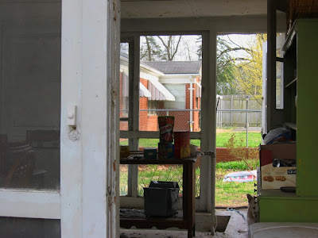

Today it was 80 degrees (in March!) and the Kids thought that it would be nice to cool off in the Ohio River. "That's too far away to walk," said Kirin, "and daddy is busy in the garage." "So?" said Kai. "We can just make our own Ohio. Get the hose!" A few minutes later, daddy's vegetable patch became a hitherto unknown tributary of [the mighty Ohio](http://en.wikipedia.org/wiki/Ohio_river) and the kids reached a hitherto unknown degree of dirtiness. Luckily, I haven't had the time to sow yet!

The unusually warm weather (or maybe this is simply the norm in Southern Illinois) prompted me to open up the breezeway. To the right you can just see the door to the garage (behind the green hatch), the railing of the stairs leading to the basement is just visible in the middle of the picture, and a door each to the kitchen and Amy's sewing room is to the left. Our yard goes up to the chain link fence and stretches along the south side of the house. The white plastic bags are manure that I plan to dig in to my (currently flooded) vegetable patch to aerate the clay soil and raise the bed a bit.
