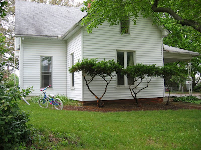
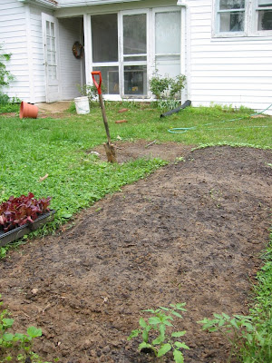

<table align="center"><tbody><tr><td>Vor den Eisheiligen... Before the spring freeze...</td><td style="width: 100px;"> </td><td>...nach den Eisheiligen. ...after the spring freeze.</td></tr></tbody></table>

Vor der Heckenschere...
Before the shears...

... nach der Heckenschere!
...after the shears!

(and the lawnmower)

<table align="center"><tbody><tr><td>Vor dem Frühlingsregen... Before the spring rain...</td><td style="width: 100px;"> </td><td>...nach dem Frühlingsregen. ...after the spring rain.</td></tr></tbody></table>

The radishes (in the back) are growing like crazy of course. Cantaloupe and Honeydew melons are coming up in the middle. I extracted the Honeydew seeds highly scientifically from a commercial melon (We'll see what comes of it in the end). In the foreground are two tomatoes graciously given to me by the Coens. I sowed French Marigolds around the whole bed to ward of some pests and, for the same reason, basil amongst the tomatoes, which also improve the flavour of tomatoes. I try to avoid chemicals where I can (to expensive for my tastes). The salad is also from the Coens and I'll have to stick it in somewhere else. The bed is full.
