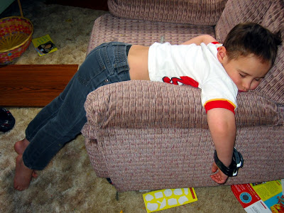

Young parents often wonder why some kids can just sleep anywhere and if you can train them that way. Before I became a dad, I assumed that you had to keep absolutely quiet and take a vow of silence, but the opposite is a better way.

Young Parent Tip #1: When the baby sleeps, go on with your life. You'll spare yourself the worries and nervous breakdowns when the neighbour rings the doorbell or daughter's brass band is coming over for a spontaneous visit. Kids who are used to a certain noise level when snoozing have much less (sleeping) problems with everyday life around them.
