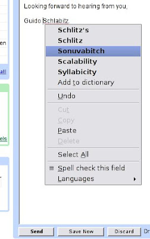

Google scheint nicht viel von mir zu denken. Ich benutze deren exzellenten Gmail-Service und die Rechtschreibprüfung besteht darauf das ich entweder ein Schlitz oder ein "Sonuvabitch" (zusammengezogenes "Son of a bitch") bin. Wird in Deutschland oft als "Sohn einer Hündin" übersetzt, besonders im Western. Bedeutet in Wirklichkeit aber eher sowas wie "Scheißkerl" oder, etwas näher am Original, "Hurensohn." Entweder fehlt da noch ein Höflichkeitsalgorithmus oder Google weis etwas das ich nicht weis... ;-)

Apparently Google doesn't think much of me. I use their excellent Gmail service and the spell checker insists that I am either a "Schlitz" (German for "slit" and other things) or a "Sonuvabitch." It is either lacking a politeness algorithm or Google seems to know something that I do not... ;-)
