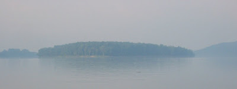
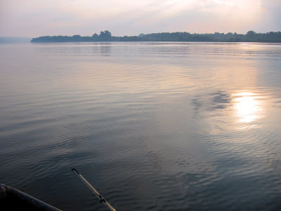
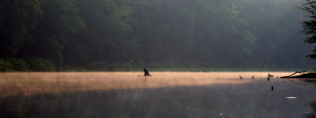
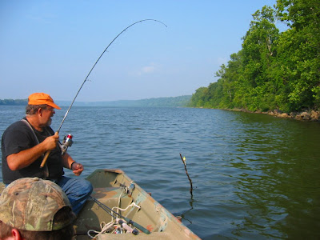
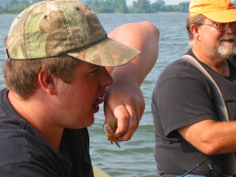
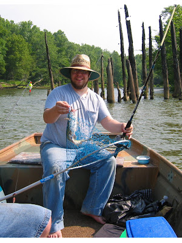
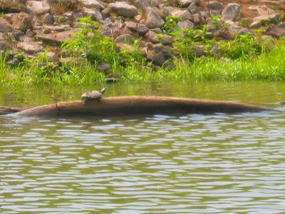

Heute ist Unabhängigkeitstag und die Männers haben dies zum Anlass genommen um eine kleine Angeltour zu unternehmen. Um 6:00 Uhr morgens war der Ohio noch etwas neblig, aber kurze Zeit später brannte die Sonne durch. Oben der Blick auf eine Insel in der Nähe der [Anlegestelle in Golconda](http://www.golcondamarina.com/), unten fahren wir flussaufwärts in Richtung Indiana.

Nach einer Weile schwenkten wir in die Mündung des Grand Pierre Creek, der große Bruder des Little Grand Pierre, der durch Dans Land fließt. Die frühe Sonne leuchtete Streifen durch die Bäume auf den Bach und lockte uns tiefer und tiefer in das Anglerparadies.

Trotz der idyllischen Szenerie wollten die Fische aber nicht beißen. Nach einer Weile gaben wir auf und ankerten am Illinois-Ufer des Ohios an.

Dort machten wir unseren ersten Fang: Dan angelte einen schwer zu ergatternden und fast legendären Stickfish (Stockfisch). Trotz ihrer Seltenheit kennen ihn aber alle Angler nur zu gut. Kurze Zeit später wurde Dans Anglerehre durch zwei Katzenwelse wiederhergestellt. Beide waren aber zu klein und wir hatten außerdem unser Fischnetz vergessen. Also wieder zurück in den Fluss.

Ryan fing sich zum Frühstück einen kleinen Barsch und aß ihn roh gleich dort im Boot.

Ich hatte schon fast aufgegeben und wollte den Morgen wie seit Jahren ohne Fisch beenden, als ein Katzenwels doch noch in meine Hühnerleber biss. Kein [legendärer](http://www.catfishcatchers.com/visitorsubmissions3.htm) [Riesenwels](http://www.indianacatfish.com/images/bfblue.jpg) und viel zu klein um ihn zu braten, aber ich war trotzdem happy.

Wie findet ihr mein Huckleberry Finn-Outfit? Barfuss und mit Strohut im Ohio angelnd. Ich hatte vor kurzem [Mark Twains Klassiker](http://de.wikipedia.org/wiki/Die_Abenteuer_des_Huckleberry_Finn) (diesmal [im Original](http://www.gutenberg.org/files/76/76-h/76-h.htm)) nochmal gelesen und kenne mittlerweile sogar einige der genannten Orte. Es ist schon fantastisch eine fiktive Welt erneut zu besuchen und dann festzustellen, das vieles gleich um die Ecke liegt. Huck und Jim haben auf ihrem Floß die Ohiomündung bei Cairo (Illinois) zwar verpasst, aber sie wären nach ein paar Meilen auf den gleichen Wassern wie wir gefahren.

Im Hintergrund ist eine alte fast komplett verottete Eisenbahnbrücke aus Holz zu sehen. Dort warf ich meinen Haken hin und fing nach ein paar Minuten meine Beute. Ein Glück hatte ich meine Kamera mitgebracht, sonst hätte mir das in der Schlabitzfamilie niemand geglaubt. Vielleicht habe ich den jahrenlangen Anglerfluch der über den Schlabitzens hängt nun endlich gebrochen?

Um den Morgen gelungen abzurunden sahen wir noch zwei Schildkröten, die sich auf einem Baumstamm sonnten. Während ich die Kamera aus der Tasche fummelte, sprang die grössere leider ins Wasser.

Danach ging es in die Creek Bar zum Steak & Eggs Frühstück. Ryan wollte eigentlich einen Double Cheeseburger, aber dafür war es selbst am Independence Day in Amerika zu früh.
