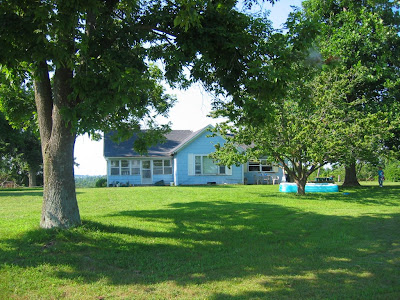
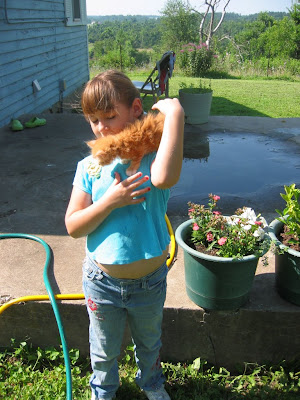
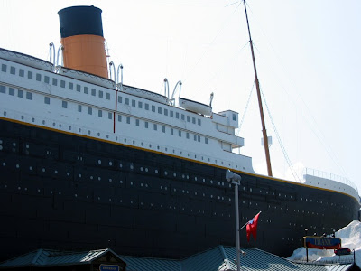

Im Juli, als wir Sara wieder nach Hause fuhren, ließen wir unsere Kinder für eine Woche bei den Georges, Amys Schwester Brendas Familie. Als wir nach einer Woche anriefen und fragten ob sie uns denn vermissten, sagten sie schlicht: "Nö! wir wollen länger bleiben."

Sie hatten viel Spaß bei Tante Brenda: ein Dutzend Kühe auf der Nachbarweide, 4 kleine Kätzchen, jeden Tag im aufblasbaren Swimmingpool planschen und soviel Eis essen wie Michael nach Hause bringen konnte (er arbeitet für [Schwan's](http://www.schwans.com/product/categoryMain.aspx?tb=2&c1=4779&c2=4800)).

Mutti hat sie natürlich doll vermisst und holte sie trotz Protest am Wochenende ab.

Bei dieser Gelegenheit haben wir uns das neue [Titanic Museum in Branson](http://www.titanicbranson.com/) angeschaut. Mit 400 originalen Ausstellungsstücken und originalgetreuen Nachbauten, z.B. [die Grand Staircase](http://www.tripadvisor.de/LocationPhotos-g44160-d598555-Titanic_Museum-Branson_Missouri.html) die zur Dinner Hall der 1. Klasse führte, war der Besuch den hohem Eintrittspreis wert.
Unten rechts im Bild kann man den Eisberg sehen, der den Eingang der 1:2 großen Facade darstellte. Alle Besucher bekommen ein Boarding Ticket, auf welchem man den Namen und die Vorgeschichte eines ehemaligen Passagiers der unglücklichen Jungfernfahrt beim Warten in der Schlange las. Am Ende der Tour kann man auf einer Denkmalstafel "seinen" Namen aufsuchen und sehen ob man überlebt hat.

Dann noch schnell in der Sushibar Mittag gegessen und es ging wieder nach Hause. Leider können wir uns zur Zeit keine längeren Ausflüge leisten.

