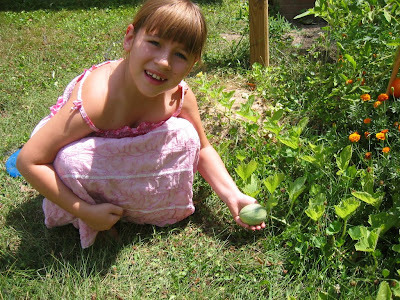
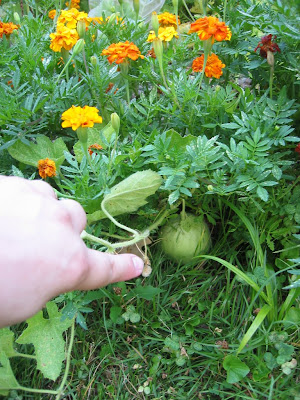
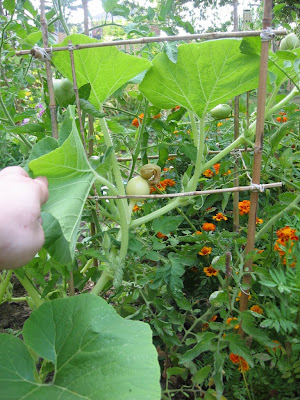

News Update zu meinem [Melonenblüteneintrag](/blog/2007-06-07-melonenblten-melon-blooms/):

Bis jetzt habe ich vier Melonen gefunden. Eine sonnte sich ganz offensichtlich auf der Wiese, eine blieb lieber zuhause im Beet und zwei versteckten sich schamhaft in den Studentenblumen.

Das Bild mit Kleingärtnerin Kirin wurde vor etwa zwei Wochen aufgenommen. Inzwischen ist die Melone dreimal so groß. Die Studentenmelonen hat Amy vorgestern entdeckt.

Apropos Größe: Die Kürbisse benehmen sich wie die Rowdys! Die sprießen riesige neue Blätter innerhalb eines Tages und rankeln sich ohne Gnade in die Tomaten und Tomatenkäfige.

Den einen Lausbub' musste ich mühsam und mit Fingerspitzengefühl aus dem Käfig extrahieren, weil er sich vorstellte seinen dicken Kürbiskopf in die Sonne strecken zu können.

Wäre natürlich viel zu schwer und sicherlich auch zu groß für den dünnen Bambuskäfig geworden.

Ich hatte ja erst so meine Zweifel an dem Ratschlag die Kürbisse zum Unabhängigkeitstag auszusäen, aber wenn die so weiter wachsen, dann sind die bestimmt rechtzeitig zur Halloween-Ernte fertig. Das wird dann unser frischster [Jack o'Lantern](http://de.wikipedia.org/wiki/Halloween)! Nicht das man das sehen könnte, aber ich habe vor wieder [einen traditionellen Pumpkin Pie](/blog/2005-11-04-halloween-update/) zu backen.
