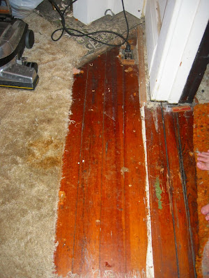
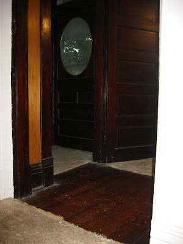
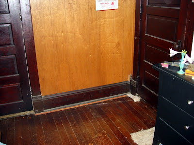

Kuck mal was wir unterm Teppich gefunden haben.

------------------------------------------->
\------------------------------------------->
\------------------------------------------->

Na gut, wir hatten das schon beim Hauskauf vermutet. Um 1920 gab es ja noch keine Auslegware, und so wurde eben das ganze Haus mit einem Holzboden ausgelegt.

Hier kann man schön die Nachlässigkeit der Vorbesitzer sehen. Es wurden nicht nur die Türrahmen weiß getüncht (die Originaltönung ist rechts am Rahmen sichtbar), sondernd auch der Boden unter der Tür... Vielleicht ist das ja die Startlinie zum Wettlauf ins Bett? Wer weiss was die sich da (nicht) gedacht haben...

In den 60ern und 70ern wurde die "Wand-zu-Wand-Auslegware" modern und einfach über das schöne Hartholz genagelt, geklebt und geklammert. Jeden Nagel, den ich sorgsam aus dem Boden ziehe tut mir in meinem Hobbyhandwerkerherzen weh. Wie konnten die nur so einen schönen Bestandteil dieses Hauses misshandeln?!

Davon mal abgesehen ist das Aufreißen des bekleckerten und verfaerbten Synthetikteppichstoffes wie ein zweites Weihnachten. Trotz der abgenutzten und malträtierten Oberfläche sieht der originale Holzboden um Klassen besser aus als die beige Wüste, die ihn für Jahrzehnte versteckt hielt.

Noch ist viel zu säubern und zu renovieren, aber ich freu mich darauf wie ein kleines Kind im Süsswarenladen.

