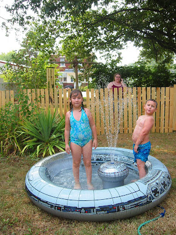
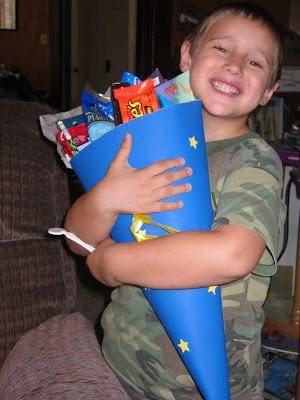

Schon sind die ersten Sommerferien im neuen Haus vorbei. Die Kinder haben tagelang im Raumschiff-Pool von Oma gespielt, viel Fernseh geseh'n (Video kommt später) und ihren Cousin Sarah genervt, die für 3 Wochen zu Besuch kam. Ich habe einen Zaun um den Hinterhof gebaut, damit Didgy endlich wieder ohne Leine leben kann.

Dieses Jahr wurde Kai eingeschult. Da es hier keine Schultüten gibt musste Papa wiedermal ran und was tütiges zusammenbasteln. Kai geht in die gleiche Grundschule, die Kirin besuchte, [Westside Elementary School](http://www.hbg.saline.k12.il.us/West/WS.html) (Klasse Kindergarten bis 2), aber Kirin geht jetzt zur [Eastside Intermediary School](http://www.hbg.saline.k12.il.us/East/es.html) (Klasse 3 bis 5). Kai macht die Schule Spaß. Er ist fast immer der erste im Auto und wenn er zusammen mit Kirin vom Schulbus nach Hause kommt, gibt er uns sofort alle Mitteilungen und passt auf, dass die Eltern die auch beachten. "Papa, das musst Du lesen und dann unterschreiben. Papa! Hast Du mich gehört?""

