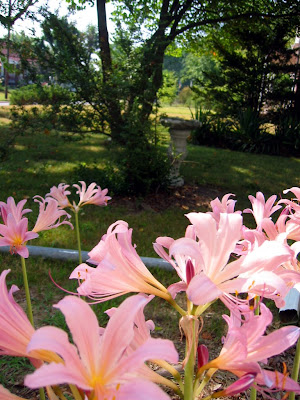
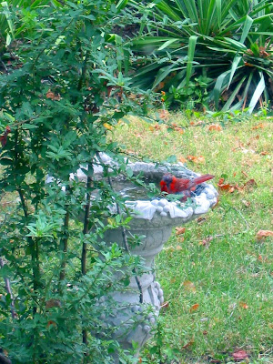

Im Frühling hatte ich haufenweise Narzissen, die einfach nicht blühen wollten. Die eine Hälfte blühte wie verrückt, und die andere machte nur eine Menge Blätter. Stellt sich heraus, dass das gar keine Narzissen, sondern "Überraschungslilien" sind, die ein paar Monate nachdem ihre Blätter abgestorben sind nochmal mit einer Blütenstaude erfreuen.

Im Hintergrund seht ihr unser neues Vogelbad. Unten mal eine Großaufnahme von einem plantschendem [Rotkardinal](http://de.wikipedia.org/wiki/Kardin%C3%A4le).

