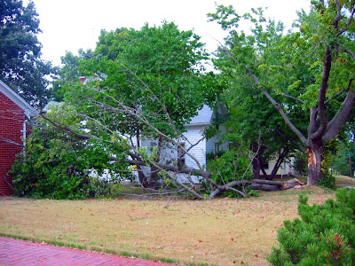

Einer unserer Bäume hat die Sommerhitze und Gewitter nicht gut überstanden. Ich saß gerade im Büro/Lesezimmer, als ich einen sehr nahen Blitzeinschlag hörte, oder zumindest klang es so, bis ein lauter, dumpfer Aufschlag folgte. Das Gewitter war zu weit entfernt und als ich aus dem Fenster schaute lag dort ein riesiger Ast im Garten. Die obere Hälfte des Astansatzes war komplett morsch und voll mit Käfern. Die untere Hälfte war OK, aber zu schwach um den Ast noch länger zu halten.

Ein Glück ist nichts zu Schaden gekommen, bis auf eine Ecke von einer Plastik-Fensterlade vom Nachbarn. Dan kam mit einer Kettensäge vorbei und die Stadt schickte eine Aufräummannschaft durch die Straßen um die größeren Äste abzuholen. Den Mittelteil konnten wir nicht zum Straßenrand rollen, und Dan sagt er will sehen, ob er es in der nächstbesten Sägemühle in Bretter zersägen kann. Es ist schließlich ein schöner Block Ahornholz.
