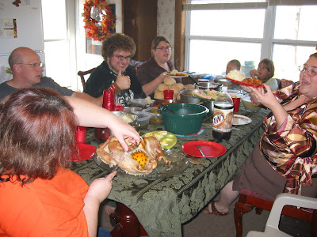
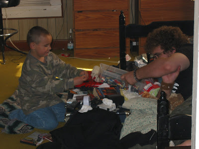
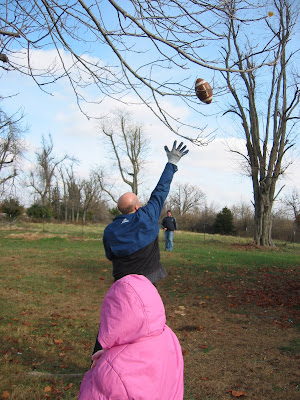
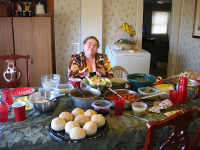
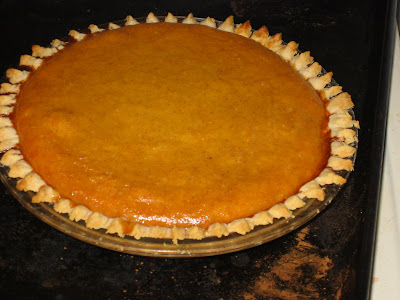
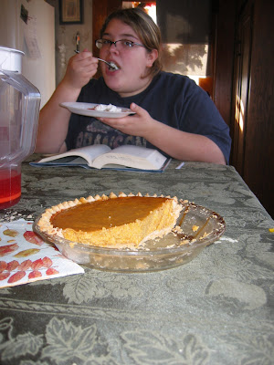

Dieses Jahr ging es zum Thanksgiving in die Nähe von [Republic, MO](http://maps.google.com/maps?f=d&hl=en&geocode=&time=&date=&ttype=&saddr=harrisburg,+il&daddr=36.949892,-90.131836+to:republic,+mo&mra=dpe&mrcr=0&mrsp=1&sz=5&via=1&sll=38.358888,-88.769531&sspn=13.386778,29.882813&ie=UTF8&z=5&om=1) (Missouri) zum ländlichen Hause der George Family. Brenda schneidet gerade den Puter in Stücke:

Einer der Vorteile eines Besuches bei den Georges ist die Anzahl der Cousins und Cousinen. So haben die Kinder immer ein Spielpartner...

... und die Erwachsenen können ernsteren Dingen nachgehen, z.B. Football:

oder Essen:

Mein hausgemachter Kürbiskuchen durfte natürlich nicht fehlen. Schmeckte wie immer prima...

... aber war diesmal natürlich schneller verschwunden als letztes Jahr.

Habe gehört, daß das Rezept das ich voriges Jahr verlinkte nicht so toll war. Ich habe aber vor bald eine ausführliche Anleitung zu verfassen. Bitte habt Geduld!
