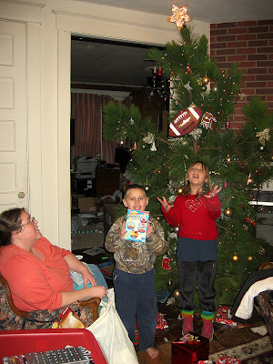
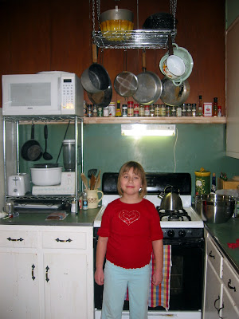
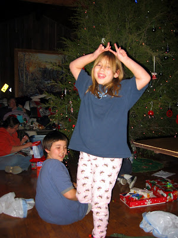

Weinachtsabend bei den Schlabitzens: Dieses Jahr haben ich und Dan unsere Weihnachtsbäume von seinem Waldgrundstück geholt. Ich eine Kiefer und er eine Zeder. Habe leider keine Tanne gesehen.

Oben rechts könnt ihr meine neue Topfregalkonstruktion sehen. Ein Metalregal an Ketten von der Decke gehangen und S-Haken für die Töpfe. Auf dem Gewürzregal stehen schon Antje's Anguckgewürze. Dankeschön!

Auch vielen Dank nochmal für das Packet. Da etwas später ankam hatten wir 3 Weihnächte: einmal zu Hause, dann bei den Coens (unten) und dann mit dem Packet aus Deutschland.

