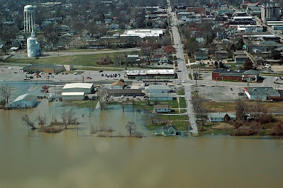

No worries, we did not get flooded, because we live in a higher part of town (behind the water tower in the picture). Unfortunately nearly all business were hit, though. In the upper-right corner of the picture above, you can see the same office building that's always seen in the web cam image. The picture is taken from the opposite part of town. Currently you still can see the water in the background in the web cam image.

Here are some photos. Call me or Amy if you want to know what you are looking at:
[http://www.harrisburg-il.com/storm/](http://www.harrisburg-il.com/storm/)

This link goes to the main page. Click on the links in the list to the right to reach the photo series.
