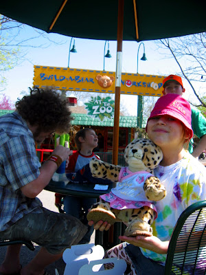
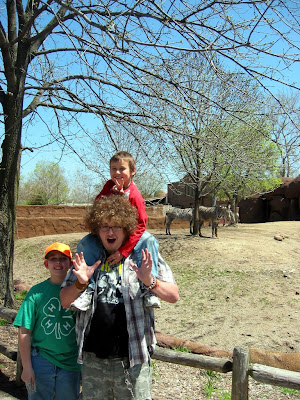
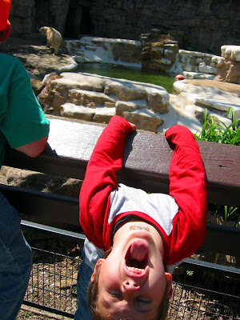

*[Image lost to time — the original was hosted on Blogspot and is no longer available.]*

Die Girl Scouts gehen zum Zoo.

Dort gab es auch eine spezielle Version des "Bau-nen-Bär"-Ladens, der statt den normalen Teddybären verschiedene Zootiere zur Auswahl hatte. In diesem Laden suchen sich die Kinder einen leeren Teddybär aus, füllen ihn mit fluffigem Fluff und suchen die Teddysachen und -schuhe und was es sonst noch alles an Teddy-Accessories gibt.

Kai dachte erst das es zu mädchenhaft ist sich eine Puppe zu bauen, aber als wir ihm erzählten das es auch Dinosaurier, Raubtiere und Affen gab wollte er natürlich auch einen Zooteddy haben. Er suchte sich ein Thyrannosaurus Rex aus und rüstete ihn sogar mit einer kleinen Dinostimme aus, damit er auch brüllen kann.

Während die Girl Scouts ihre Stationen machten, hatten die Jungs im Rest des Zoos freien Lauf.

