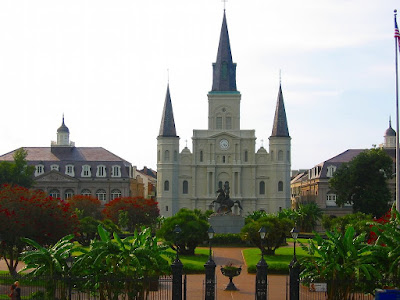
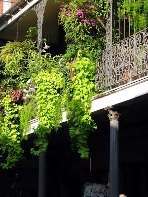
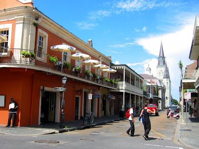
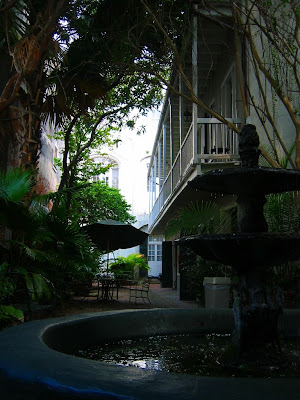
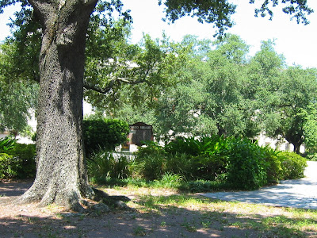

Jackson Square is the heart of the French Quarter, which in turn forms the historic and cultural center of the city of New Orleans. As a strategic port city of the sometimes Spanish, sometimes French colony of Louisiana (named after the "Sun King" Louis XIV), it became a outpost of European culture, which soon, enriched by African and Native American influences, brought forth Cajun and Creole. Both define what New Orleans is known for worldwide: music, hearty, spiced dishes, and an inimatable atmosphere.

Starting from the St. Louis Cathedral through the Vieux Carre, we walk by spanish townhouses adorned with balconies made from iron filigree. Sometimes we catch a glimpse into the private courtyard paradises, shaded by tropical foliage, cooled by glittering fountains.

A short time later we reach Congo Square, where slaves gather for tribal dances. These were forbidden on Sundays. Every slave had to attend church. Even though, they found enough parallels in the Catholic religious system to continue, after some adjustments, their own spiritualism, almost publicly. God, the Father, is like Voudoun, the great Creator Spirit. The flock of saints, corresponds with the lesser African spirits, which were asked for more mundane things like safe travel, more money, or less stomach aches. Just like these religions coalesced into the often misunderstood and, at times deliberately, distorted religion of Voodoo, the worship cantatas of Bach, the melodies of Mozart, and the syncopated rhythms of the log drums created a new brew, which only could ferment in the hot swamps of New Orleans: [*Jazz!*](http://michalevy.com/giantsteps_download)

