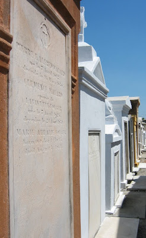
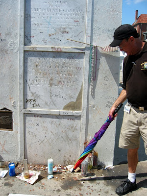
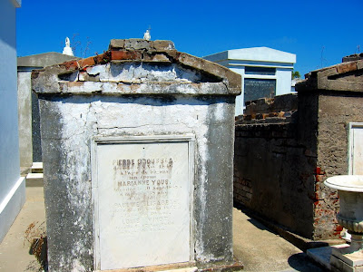

Die Friedhöfe in New Orleans sind bekannt Touristenattraktionen. Wegen der hohen Kriminalrate, wird empfohlen sie nur mit einer geführten Gruppe zu besuchen. Unsere Tour wurde von einem pensioniertem Park-Ranger organisiert, der sich so ein kleines Nebeneinkommen verdient. Wir trafen uns beim Café Beignet und [liefen von dort zum St. Louis Friedhof Nr. 1](http://maps.google.com/maps?f=d&saddr=334+Royal+St+%23+B,+New+Orleans,+LA+70130+%28Cafe+Beignet%29&daddr=Conti+St+to:29.959025,-90.071057&hl=en&geocode=FTcUyQEdrK6h-iGDcIey7KTT9w%3BFWogyQEdWqGh-g%3B&mra=dme&mrcr=0&mrsp=2&sz=17&via=1&dirflg=w&sll=29.95711,-90.069083&sspn=0.00633,0.009656&ie=UTF8&z=17).

Auf dem Weg lernten wir viel neues über die frühe und moderne Geschichte der Stadt, z.B. wie aus einer unbekannten Statue in einem Schnellpacket (Eilpost heisst auf English "expedite") der Heilige St. Expedite wurde und wo die Katrina- Überschwemmungswasserliene verlief.

Der Friedhof sieht aus wie eine Mausoleumsstadt, komplett mit Haupt- und Nebenstraßen, Kathedralen, Bürgerhäusern, und sogar schubfachartige "Neubauten" für Tote die sich keine Familiengruft leisten können.

Hier mal eine Satellitenansicht:

[View Larger Map](http://maps.google.com/maps?ie=UTF8&t=h&ll=29.959324,-90.071477&spn=0.000558,0.000858&z=20&source=embed)

Viele lokale Persönlichkeiten haben hier ein Grabmal, aber eine ist besonders bekannt: die [Voodoo-Priesterin Marie Laveau](http://de.wikipedia.org/wiki/Marie_Laveau).

Viele ihrer Anhänger besuchen noch heute das Grab regelmässig und hinterlassen oft Opfergaben in der Hoffnung das ihre Gebete erhört werden.

Die XXX Markierungen entstammen einem Liebesritual:
1) Klopfe dreimal auf Marie Laveaus Grab
2) Mache drei X nebeneinander
3) Sprich Deinen Liebeswunsch laut aus, z.b. "Marie Laveau, Priesterin der Liebe, mach das Klaus mich unwiderstehlich findet!"
4) Hinterlasse eine Opfergabe

Entstellung der historischen Gräber ist natürlich gesetzeswiedrig und muss deshalb im geheimen, am besten nachts, passieren.

Der Mann mit dem Regenbogenschirm ist unser Tourführer.

Der Hauptgrund für diese Art von Bestattung, ist der hohe Wasserspiegel New Orleans, da die komplette Region ein großer Sumpf ist, aber die französichen und spanischen Traditionen habe fast genausoviel damit zu tun.

Die Familienmausoleen werden durch die Generationen erhalten und wiederverwendet. Falls eine Beerdigung erst neulich stattfand, werden die neuen Überreste erst in der Friedhofsmauer in einer "Knochenhöhle" zwischeninterniert. Nach relativ kurzer Zeit (2-3 Jahre) hat das lokale tropische Klima plus Bakterien die Überreste gut durchgebacken und in feine Asche verwandelt. Dann werden sie in die Familiengruft überführt.

