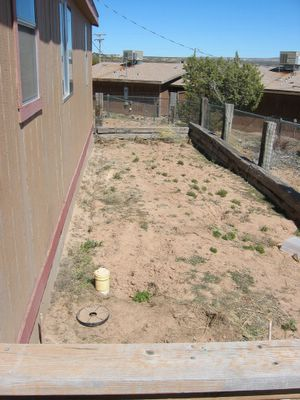

Schonwieder Mittwoch und nichts geschrieben... Na wenigstens ist nicht nur mein Blog vernachläßigt: Seht euch nur mal diesen Garten an! Der sollte schon Beete umgegraben haben, das Sulfat hab ich auch noch nicht ausgestreut (der Boden hat hier einen pH von 6) und das Gartentor liegt noch in Einzelteilen rum.

Der Komposthaufen ist hinten links um die Ecke (glaubt ihr mir?) und das Hauptbeet (Gemüse) geht links am Haus entlang (wie man leicht sehen kann). Am Zaun pflanz ich diverse pflegeleichte Blumen an (irgendwann mal).

Bis zur nächsten Folge, wo neben dem Unkraut hoffentlich bald andere (geplante) Dinge grünen werden,

Euer grüner Gartenguido.

Your green garden guido.
